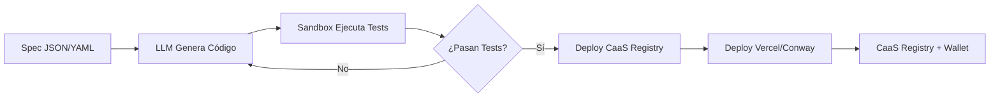

# 🌱 FUENTE MASTER DIDÁCTICA PARA DUMMIES
## Guía Cariñosa, Afiliativa e Ilustrativa del REPO COMPLETO HSCSG v15 OS
### Para Simpatizantes, Curiosos y Futuras Colaboradoras

> *"La seriedad sin humor es rigidez. El humor sin seriedad es evasión. El humor afiliativo es el lubricante de la verdad."*

---

## 🌸 Bienvenidx, Alma Curiosa

Si estás leyendo esto, probablemente hayas aterrizado en el repo **HSCSG_v15_OS** y te hayas encontrado con una constelación de carpetas, skills, código TypeScript/Go, documentos markdown, y te hayas preguntado: **"¿Qué es todo esto? ¿Por dónde empiezo? ¿Esto es para mí?"**

**Respuesta corta: SÍ. Este repo es para ti.** Aquí vive la **implementación técnica completa** de la visión que leíste en la *Propuesta para la Gran Confederación*. Este es el **taller**, la **cocina**, el **dojo** donde se construye día a día.

> **Regla de oro**: *Si algo suena demasiado técnico, respira. Vuelve a leer despacio. Pregunta. No hay preguntas tontas, solo respuestas que aún no encontraron su forma amorosa.*

---

## 🗺️ MAPA DEL TESORO: Estructura del Repo (Vista de Águila)

```
HSCSG_v15_OS/
├── 📁 src/                    # Núcleo TypeScript (Kernel, Loop Engine, CaaS, Wallet)
├── 📁 tool-forge/             # 🛠️ Fábrica de Herramientas (CaaS Engine, Generador, QR 3D, Wallet)
├── 📁 skills/                 # 🧠 20+ Skills HSCSG (cerebros reutilizables)
├── 📁 docs/                   # 📚 Documentación técnica y de arquitectura
├── 📁 scripts/                # 🔧 Scripts de automatización, backup, deploy
├── 📁 services/gpl-isolated/  # ⚖️ Servicios GPL aislados (licencias)
├── 📁 runtime/vessel-core/    # 🚀 Runtime sandbox para agents
├── 📁 public/                 # 🌐 Assets públicos (web)
├── 📁 .github/workflows/      # 🤖 CI/CD (GitHub Actions)
├── 📁 .devin/                 # 🤖 Config Devin AI
├── 📁 _scratch/               # 🧪 Arena de juegos / experimentos
├── 📄 PROPUESTA PARA LA GRAN CONFEDERACIÓN - HUMANOS_SOBERANOS.md  ← Documento maestro
├── 📄 FUENTE_MASTER_DIDACTICA_DUMMIES_HSCSG_v15.md                ← Guía para dummies (esta)
├── 📄 HSCSG_v14_CONSOLIDADO_CON_CORRECCIONES.md                   ← Corpus consolidado v14
├── 📄 HSCSG_v14_CONSOLIDADO.md                                   ← Versión anterior
└── 📄 package.json / tsconfig.json / .prettierrc / .gitignore    # Config base
```

> **Regla de oro**: *Si una carpeta te intimida, no la abras aún. Sigue leyendo esta guía. Cuando sientas el llamado, entra.*

---

## 💚 CAPÍTULO 1: ¿QUÉ ES HSCSG v15 OS? (En Lenguaje Humano)

### La Metáfora del Dojo

> *"Un dojo para entrenar antes de arrojarnos al precipicio... Es por esto, que 'El dojo al borde del precipicio' lleva tal nombre. Porque su vida está en juego y nuestro tiempo puede estar contado."* — **Amid Dabir**

**HSCSG v15 OS** es un **Sistema Operativo Holosociocibersimbiótico** (sí, el nombre es largo, pero cada palabra importa):

| Palabra | Qué Significa en la Práctica |
|---------|------------------------------|
| **Holo** | Todo está en todo (holográfico, no fragmentado) |
| **Socio** | Lo social es primario, no accesorio |
| **Ciber** | Vive en lo digital, pero toca lo físico |
| **Simbiótico** | Relación mutuamente beneficiosa, no parasitaria |
| **génesis** | Nace, crece, evoluciona, no se impone |
| **v15 OS** | Versión 15, **Sistema Operativo** (no app, no librería: OS) |

### Qué ES en la Práctica

| Qué ES | Qué NO ES |
|--------|-----------|
| **Un kernel de auditoría** (Kernel) que dice "esto cuadra / no cuadra" | Un gobierno, un jefe, una autoridad |
| **Un sistema de intercambio** (TQ) en **kWh y horas** | Una criptomoneda especulativa |
| **Una red federada** (Gaia/RIDF) que conecta sin absorber | Una plataforma centralizada |
| **Un sistema de preparación** (HSCSG) para estar listo | Una certificación, un título, un carnet |
| **Un motor epistemológico** (Alráico/Capa 0) que evita colapsos cognitivos | Una IA que decide por ti |
| **Una fábrica de herramientas** (Tool Forge/CaaS) que genera Micro-SaaS | Un marketplace de apps cerradas |
| **Un autómata soberano** que se automejora versionado en git | Un bot que te reemplaza |
| **Una economía anfibia** (ZNU/FRNE ↔ USDC) | Una criptomoneda más |

> **En una frase**: *HSCSG v15 OS es el sistema operativo para una civilización post-mercado, post-dependencia, post-centralización. No es una utopía literaria: es código que compila, tests que pasan, y despliegues en Vercel/Conway Cloud.*

---

## 🗺️ CAPÍTULO 2: TOUR GUIADO POR EL REPO (Carpeta por Carpeta)

### 📁 `src/` — El Corazón TypeScript (Kernel Vivo)

```
src/
├── core/
│   ├── lib/
│   │   ├── loopEngine.ts          ← 🧠 MOTOR ALRÁICO (6 loops + γ-CARMIS + resonancia)
│   │   ├── caas-engine.ts         ← 🏭 CaaS Engine (dual mode: ZNU ↔ USDC)
│   │   ├── tool-generator.ts      ← 🤖 Generador Spec→LLM→Sandbox→Deploy→Registry
│   │   ├── qr-3d-generator.ts     ← 📐 QR 3D (PNG/SVG/3MF/STL + Three.js)
│   │   ├── valueDual.ts           ← 🐸 Economía Anfibia: ZNU ↔ USDC (priceParity)
│   │   ├── nodeMode.ts            ← 🌐 Modo nodo: offline ↔ conectado
│   │   └── types.ts               ← 🏷️ Tipos centrales (ECROx, CaaS, Wallet, etc.)
│   └── state/
│       └── store.ts               ← 🧠 Estado global (Zustand + persistencia)
├── agent/
│   ├── tools.ts                   ← 🛠️ Registry de tools del agente
│   └── tools/
│       └── caas-wallet.ts         ← 👛 CaaS Wallet (DID, ZNU/FRNE, tiers, gates)
├── heartbeat/
│   └── gossip.ts                  ← 💓 Heartbeat/Gossip (asimilado de RIDF)
├── ledger/
│   └── mutual-credit.ts           ← 💰 Ledger mutuo (Trustlines, pools, hash chain)
├── inference/
│   └── router.ts                  ← 🤖 Router de inferencia (multi-modelo)
├── memory/
│   └── store.ts                   ← 🧠 Memoria persistente del agente
└── app/
    ├── screens/                   ← 🖥️ Pantallas (Simulador, Wallet, Dashboard)
    └── components/                ← 🧩 Componentes UI reutilizables
```

> **Archivos Clave para Empezar**:
> - `loopEngine.ts` → **El cerebro Alráico** (lee este primero si te gusta lo profundo)
> - `caas-engine.ts` → El motor económico dual (ZNU ↔ USDC)
> - `types.ts` → El diccionario de tipos (ECROx, CaaS, Wallet, NodeMode)


### 🧠 `skills/` — Los 20+ Cerebros Reutilizables (¡El Superpoder!)

Cada skill es un **cerebro especializado** que sabe hacer UNA cosa muy bien. Se invocan entre sí como **vasos comunicantes**.

| Skill | Categoría | Qué Hace en Una Frase |
|-------|-----------|----------------------|
| `hscsg-reverse-business-architect` | business | Ingeniería inversa de modelos de negocio → ofertas lanzables |
| `hscsg-operational-bottleneck-hunter` | operations | Detecta/elimina cuellos de botella invisibles via Q&A |
| `hscsg-passive-income-architect` | finance | 3-5 motores ingreso pasivo personalizados |
| `hscsg-business-idea-validator` | business | Validación nivel VC (TAM/SAM, score 1-10) |
| `hscsg-design-marketing-factory` | marketing | Design System Apple HIG + 47 assets marketing |
| `hscsg-github-bookmark-extractor` | devops | Extrae URLs GitHub de marcadores exportados |
| `hscsg-repo-assimilation-pipeline` | devops | Pipeline maestro 7 etapas para asimilar repos |
| `hscsg-operational-bottleneck-hunter` | operations | Cuellos de botella invisibles via Q&A |
| `hscsg-sistema-alraico` | alraico | Kernel Alráico: loops, γ-CARMIS, resonancia |
| `hscsg-coeficiente-autonomia` | alraico | AUT/CDS, Gate MJ, niveles soberanía |
| `hscsg-orquestador-skills` | alraico | Router 9 skills + vasos comunicantes |
| `hscsg-unified-assimilation-science` | alraico | Ciencia unificada asimilación (5 fases) |
| `hscsg-repo-assimilation` | alraico | Metodología 4 fases (backup→análisis→gen→validación) |
| `hscsg-monetary-integration` | alraico | G1/Túmin/PAR/Bitcoin → ZCS/ZNU |
| `hscsg-multi-framework-integration` | alraico | Integración multi-framework en docs |
| `hscsg-scientific-papers` | alraico | Protocolo papers científicos/repos técnicos |
| `hscsg-document-architect` | alraico | Arquitecto documentos grandes/unificados |
| `hscsg-next-steps-orchestrator` | alraico | Orquestador próximos pasos + referencias |
| `hscsg-urgent-financial-prototype` | devops | Deploy financiero urgente (Tool Forge) |
| `Sistema-Alraico-loop-engineering-skill` | alraico | Canvas Alráico (20 límites, ECROx, CSV) |

> **Cómo se usan**: Se invocan desde el **Orquestador** (`hscsg-orquestador-skills`) que decide qué skill activa según el contexto. ¡No necesitas conocerlas todas! El orquestador elige por ti.

### ⚖️ `services/gpl-isolated/` — Servicios GPL Aislados (Legal First)

```
services/gpl-isolated/
├── docker-compose.yml
├── Dockerfile
└── src/                           ← Microservicios GPL/AGPL aislados
```

**Por qué existe**: HSCSG respeta licencias **radicalmente**. Código GPL/AGPL vive **aislado en contenedores**, comunicándose solo via **API/JSON** con el núcleo MIT/Apache. **Cero contaminación legal**. Auditoría automatizada en CI/CD (`license-checker`).

### 🚀 `runtime/vessel-core/` — El Sandbox para Agentes

```
runtime/vessel-core/
├── Cargo.toml                     ← Rust (seguridad memoria)
├── src/
│   ├── main.rs                    ← Entry point
│   ├── sandbox/                   ← Aislamiento (seccomp, namespaces)
│   ├── executor/                  ← Ejecución código untrusted
│   └── policy/                    ← Políticas de recursos (CPU, RAM, red)
```

**Para qué**: Ejecutar código **no confiado** (LLM-generated, user code) de forma segura. Usado por **Tool Forge** en paso "Sandbox".

### 📁 `docs/` — Documentación Técnica y Arquitectónica

| Archivo | Qué Encuentras |
|---------|----------------|
| `architecture.md` | Arquitectura completa (Mermaid diagrams) |
| `federation.md` | Federación RIDF (modos, ledger, governance) |
| `federation_governance.md` | Niveles nodo, consenso, expulsion |
| `api.md` | API REST endpoints |
| `backend-i18n-plan.md` | Plan internacionalización |
| `HSCSG_v14_CONSOLIDADO.md` | Corpus consolidado v14 |

### 📁 `scripts/` — Automatización y Mantenimiento

| Script | Qué Hace |
|--------|----------|
| `backup-restore.sh` | Backup/restore completo (pre-asimilación) |
| `soak-test.sh` | Test de estrés prolongado |
| `deploy.sh` | Deploy automatizado Vercel/Conway |
| `license-check.sh` | Auditoría licencias (CI/CD) |

### 📁 `.github/workflows/` — CI/CD (GitHub Actions)

| Workflow | Qué Hace |
|----------|----------|
| `ci.yml` | `tsc --noEmit` + `go test ./...` + lint + license-check |
| `release.yml` | Release automático + changelog + Docker images |
| `deploy-frontend.yml` | Deploy frontend a Vercel |
| `deploy-backend.yml` | Deploy backend a Conway Cloud/Railway |

---

## 🧠 CAPÍTULO 3: LOS 4 PILARES VIVOS (Ya Los Conoces, Pero Ahora Ves Su Código)

### 1. 🔍 **Kernel** (`src/core/lib/loopEngine.ts`)
- **6 loops** + **γ-CARMIS** + **resonancia** por tick
- `detectOverloads()` → ΣPᵢ > κ → γ-CARMIS reconfigura
- `detectResonances()` → αʰ₁·αʰ₂·3.0 > αʰ₁+αʰ₂
- **Tests**: 7/7 passing (`loopEngine.test.ts`)

### 2. ⚡ **TQ** (En `tool-forge/backend` + `src/core/lib/valueDual.ts`)
- **Dual metric**: Vía A (horas, servicios humanos) + Vía B (kWh, bienes)
- **Ancla física**: 1 TQ = 1 kWh (DISEÑO, no dato universal)
- **Anfibio**: ZNU (offline) ↔ USDC vía priceParity (Nivel 3 ReFi)

### 3. 🌐 **Gaia / RIDF** (En `tool-forge/backend/` + `src/heartbeat/` + `src/ledger/`)
- **Federación**: 3 modos (Internet / Intranet Mesh / Híbrido)
- **Ledger**: Piscina Global + Bilaterales, firma dual, hash chain
- **Gobernanza**: 3 niveles, consenso 100%, niveles nodo (1→2→3)
- **Federación automática**: 1 sponsor + propagación exponencial E2E

### 4. 🌱 **HSCSG** (Preparación + Alráico)
- **No certifica**: Prepara contexto, ofrece experiencias, mapa de límites
- **Alráico integrado**: 20 límites, γ-CARMIS, PI, 𝕮, Triaxial
- **Tool Forge**: Genera herramientas que el usuario necesita ANTES de entrar

---

## 🧠 CAPÍTULO 4: EL SISTEMA ALRÁICO — EL CEREBRO QUE EVITA COLAPSOS

> **Ubicación**: `src/core/lib/loopEngine.ts` + `skills/Sistema-Alraico-loop-engineering-skill/`

### La Ecuación Maestra: γ-CARMIS

```
SI ΣPᵢ > κ  (sobrecarga total > umbral)
    ENTONCES γ-CARMIS ACTIVADO
         → Reorganización consciente (no parche)
         → Nueva configuración estable
```

### Los 20 Límites Cognitivos (Tu Mapa de Fallas)

| Límite | Nombre | Qué Detecta |
|--------|--------|-------------|
| L1 | Omnisciencia Falsa | Creer que lo sabes todo |
| L6 | Hipergeneralización | Un caso = regla universal |
| L7 | Disonancia Cognitiva (HD) | Negar evidencia que contradice |
| L11 | Falacia de Control | Creer controlar lo incontrolable |
| L17 | Pensamiento Binario | Todo blanco o negro |
| ... | ... | ... (20 total, mapeados en CSV) |

> **Uso real**: *Cuando un nodo/asamblea/kernel se traba, el Alráico diagnostica QUÉ límite se activó y aplica γ-CARMIS para reconfigurar conscientemente.*

### La Transducción F: El Traductor Universal

```
Problema en Dominio X  →  {X} → 𝕮 (ECROx: αʰ, s, y, v, XP, k)  →  {Y}  →  Solución en Dominio Y
```

**Ejemplo**: Problema económico → 𝕮 (αʰ=armonía, s=sincronía, γ=calidad, κ=umbral) → Solución social+técnica+personal coherente.

---

## 🛠️ CAPÍTULO 5: TOOL FORGE — TU FÁBRICA PERSONAL DE HERRAMIENTAS

### El Pipeline Mágico (Spec → Herramienta Viva)



### Tu Primera Herramienta en 3 Pasos

1. **Escribe `spec.yaml`**:
```yaml
name: "csv-to-json"
description: "Convierte CSV a JSON con tipos inferidos"
input: { type: "file", format: "csv" }
output: { type: "file", format: "json" }
constraints: ["streaming", "memory-efficient", "type-inference"]
```

2. **Ejecuta**:
```bash
cd tool-forge
npm run generate spec.yaml
```

3. **¡Lista!** → Tienes:
   - Código TypeScript/Go/Python probado
   - Deploy en Vercel/Conway Cloud
   - Entrada en CaaS Registry
   - CaaS Wallet configurada (cobra ZNU/USDC por uso)


---

## 🐸 CAPÍTULO 6: ECONOMÍA ANFIBIA — ZNU / FRNE / USDC

### El Principio Anfibio (¡Mismo Código, Distinta Etiqueta!)

```typescript
// En valueDual.ts
function calculateValue(amount: number, mode: 'postmonetario' | 'con-moneda'): ValueDual {
  const znu = amount * ZNU_RATE;           // Modo postmonetario
  const usdc = amount * priceParityOracle(); // Modo conectado (oráculo Nivel 3 ReFi)
  
  return { znu, usdc, mode: mode };  // El render decide la etiqueta
}
```

| Modo | Unidad | Cuándo | Wallet |
|------|--------|--------|
| **Offline / RAO Local** | **ZNU** (Zona Neutra Unitaria) + FRNE | Sin internet, ferias, offline-first |
| **Conectado / Online** | **USDC** vía **priceParity** (Nivel 3 ReFi) | Con internet, comercio externo |

> **Clave**: *La LÓGICA es IDÉNTICA. Solo cambia la ETIQUETA (ZNU vs USDC). El render decide qué mostrar.*

### 3 Tiers (Modelo Skilio Adaptado)

| Tier | Acceso | Cómo se Paga | Para Quién |
|------|--------|--------------|------------|
| **FREE** | Básico + Ads éticos | Atención (tiempo) | Exploradores, curiosos |
| **PRO** | Completo + Sin ads | **Quema ZNU** (contribución por uso) | Constructores, makers |
| **ENTERPRISE** | B2B + Trustlines + SLA | **Crédito mutuo ZNU** (Trustlines) | Orgs, cooperativas, empresas |

### 💰 ZNU / FRNE / priceParity

| Concepto | Qué Es | Fórmula |
|----------|--------|---------|
| **ZNU** | Zona Neutra Unitaria | `contribución × AUT / CDS` |
| **FRNE** | Fondo Reserva No Especulativo | `Σ excedentes × 0.4` (reinversión) |
| **priceParity** | Oráculo Nivel 3 ReFi | `USDC/ZNU = f(mercado, reservas, AUT)` |

---

## 🤖 CAPÍTULO 7: AUTOMATON — EL AUTÓMATA QUE SE AUTOMEJORA

### Roadmap de 5 Fases

| Fase | Horizonte | Hito Clave | Estado |
|------|-----------|------------|--------|
| **0. Validación** | Meses 1-3 | 10 diagnósticos beta, precio 180 ZNU validado | ✅ En curso |
| **1. Productización** | Meses 4-9 | Micro-SaaS desplegado, Autómata v0.1 en Conway Cloud | 🔄 Próximo |
| **2. Escalamiento** | Meses 10-18 | 50 colectivos, autofinanciamiento, 1er autómata hijo | ⏳ |
| **2b. Consolidación** | Meses 19-24 | v1.0, 3-5 autómatas hijos, reinversión 40% | ⏳ |
| **3. Ecosistema** | Años 2-5 | 100 colectivos, 5 territorios, 10 autómatas | 🌱 |

### Automejora Versionada (Git-Native)

```bash
# El autómata se automejora y versiona en git
git commit -m "feat(automaton): automejora v0.1.3 - optimicé loopEngine tick -15%"
git tag v0.1.3
git push origin main --tags
```

> **Cada mejora es un commit auditable. No caja negra. Auditoría git nativa.**

---

## 👁️ CAPÍTULO 8: LAS 3 GAFAS (Triple Perspectiva) — Tu Lente Tríplice

**Regla de Oro**: *Todo se mira con 3 gafas. Si una falla, la propuesta no pasa.*

| Gafa | Pregunta | Qué Miras | Herramientas |
|------|----------|-----------|--------------|
| 🟦 **Ontológica** | **¿Qué ES?** | PI, ECROx, identidades, grafo de rastros, 𝕮 | PI, ECROx, 𝕮 |
| 🟨 **Teleológica** | **¿Qué HACE?** | Protocolos, transductores F, γ-CARMIS, CaaS | Transductores F, γ-CARMIS, flujos |
| 🟩 **Axiológica** | **¿Qué VALE?** | AUT/CDS, resonancia, Gate MJ, Triaxial, ECROx | AUT/CDS, Resonancia, Gate MJ |

> **Regla de Oro**: *Toda propuesta, protocolo, auditoría, transducción debe validarse en las **3 perspectivas** = **Verificación Triaxial Obligatoria**.*

---

## 😄 CAPÍTULO 9: LA CULTURA QUE HACE QUE TODO FUNCIONE

### 😄 Humor Afiliativo
> *"La seriedad sin humor es rigidez. El humor sin seriedad es evasión. El humor afiliativo es el lubricante de la verdad."*

- En **docs**, **código**, **naming**, **errores**, **UI**
- Ejemplo: `gammaCARMIS.test.ts` tiene tests llamados `"should not panic when lucidez is off"`
- Desarma sustancializaciones, facilita **corrección sin defensa**

### 🐸 Principio Anfibio
> **Misma lógica, distinta etiqueta.**
> - Offline → ZNU/CaaS (postmonetario)
> - Conectado → USDC vía priceParity (Nivel 3 ReFi)
> - **La lógica es agnóstica a la unidad. El render decide la etiqueta.**

### ♾️ Beta Perpetua
> **La vida no se resuelve, se itera.**
> - No versión final
> - Iteración indefinida
> - `CHANGELOG.md` vivo, no `CHANGELOG.md` muerto

---

## 🗺️ CAPÍTULO 10: HOJA DE RUTA — TU MAPA DE PARTICIPACIÓN

| Hito | Qué Se Hace | Quién | Validación |
|------|-------------|-------|------------|
| **§56 RIDF** | Integrar federation.go, ledger, node_levels en Automaton | Equipo RIDF | `go test ./...` + `tsc --noEmit` |
| **§57 Alráico** | Integrar loopEngine.ts + Canvas en kernel | Amid + Isaac | `gammaCARMIS` test (7/7 passing) |
| **§58 HSCSG v15** | Deploy Tool Forge Vercel + CaaS Wallet | Equipo Zeitnus | Deploy OK + `tsc --noEmit` |
| **§59 Triple Perspectiva** | Validar TODO bajo 3 gafas | Consejo Epistemológico | Triaxial passing |
| **🗺️ Próximos Pasos** | Ejecutar esta tabla | Consejo + Next Steps Orchestrator | Tick Alráico semanal |

---

## 🤝 CAPÍTULO 10: ¿CÓMO ME SUMO HOY? (Según Tu Perfil)

| Perfil | Por Dónde Entrar | Primer Comando / Acción |
|--------|------------------|-------------------------|
| **💻 Desarrollador/a Fullstack** | `src/` + `tool-forge/frontend` | `git clone` → `npm i` → `npm run dev` |
| **🦀 Backend / Go / Rust** | `tool-forge/backend/` + `runtime/vessel-core/` | `cd tool-forge/backend && go test ./...` |
| **🎨 Diseñador/a UX/UI** | `tool-forge/frontend/` + `skills/hscsg-design-marketing-factory` | Revisa Design System (Apple HIG) en `tool-forge/frontend/src/components` |
| **📊 Economista / Finanzas** | `src/core/lib/valueDual.ts` + `skills/hscsg-monetary-integration` | Lee `valueDual.ts` + `monetary-integration` skill |
| **🧠 Facilitador/a Social / Psicología** | `skills/hscsg-sistema-alraico/` + `skills/hscsg-coeficiente-autonomia` | Lee `Sistema-Alraico-loop-engineering-skill` + `coeficiente-autonomia` |
| **📚 Documentalista / Technical Writer** | `docs/` + `skills/hscsg-document-architect` | Revisa `docs/` + `hscsg-document-architect` skill |
| **🧪 QA / Testing** | `.github/workflows/ci.yml` + `tool-forge/backend/*/test` | `npm run test:all` / `go test ./...` |
| **🌱 Curiosx de Corazón** | Lee, siente, pregunta | **Empieza por esta guía** → luego `PROPUESTA...md` |

### 🎯 Tu Primer PR (Pull Request) en 5 Minutos

1. **Fork** el repo: https://github.com/Isaacko0/HSCSG_v15_OS/fork
2. **Clona tu fork**: `git clone https://github.com/TU_USER/HSCSG_v15_OS`
3. **Crea rama**: `git checkout -b mi-primer-aporte`
4. **Toca algo pequeño**: Corrige un typo en un `.md`, agrega un comentario en código, mejora un README
5. **Commit**: `git add . && git commit -m "docs: pequeño aporte cariñoso desde el corazón"`
6. **Push**: `git push origin mi-primer-aporte`
7. **PR**: Abre Pull Request en GitHub → **¡Celebramos tu primer merge!** 🎉

---

## 📚 CAPÍTULO 11: BIBLIOTECA DE REFERENCIA RÁPIDA (Para Tener a Mano)

| Qué Buscas | Archivo / Link | Qué Encuentras |
|------------|----------------|----------------|
| **Documento Maestro (Visión)** | `PROPUESTA PARA LA GRAN CONFEDERACIÓN - HUMANOS_SOBERANOS.md` | Visión completa, arquitectura, principios |
| **Guía para Dummies (Colaboración)** | `FUENTE_MASTER_DIDACTICA_DUMMIES_HSCSG_v15.md` | Guía colaboración actual (RIDF+Alráico+HSCSG) |
| **Guía Master Repo Completo (Esta)** | `FUENTE_MASTER_DIDACTICA_REPO_COMPLETO_HSCSG_v15.md` | **Este documento** |
| **Corpus Consolidado v14** | `HSCSG_v14_CONSOLIDADO_CON_CORRECCIONES.md` | Corpus base (Kernel, TQ, Gaia, HSCSG, Alráico) |
| **Kernel Loop Engine** | `src/core/lib/loopEngine.ts` | Motor Alráico (6 loops + γ-CARMIS) |
| **CaaS Engine** | `src/core/lib/caas-engine.ts` | Motor CaaS dual (ZNU/USDC) |
| **Tool Generator** | `src/core/lib/tool-generator.ts` | Pipeline Spec→LLM→Deploy |
| **CaaS Wallet** | `src/agent/tools/caas-wallet.ts` | DID, ZNU/FRNE, tiers, gates |
| **RIDF Federation** | `tool-forge/backend/` + `docs/federation.md` | Federación real (Go, mTLS, ledger) |
| **Alráico Loop Engine** | `skills/Sistema-Alraico-loop-engineering-skill/` | Canvas, 20 límites, ECROx, CSV |
| **Alráico Kernel Skill** | `skills/hscsg-sistema-alraico/` | Kernel Alráico para nodos |
| **Coeficiente Autonomía** | `skills/hscsg-coeficiente-autonomia/` | AUT/CDS, Gate MJ, niveles |
| **Orquestador Skills** | `skills/hscsg-orquestador-skills/` | Router 9 skills + vasos comunicantes |
| **Asimilación Unificada** | `skills/hscsg-unified-assimilation-science/` | 5 fases asimilación |
| **Repo Asimilación** | `skills/hscsg-repo-assimilation/` | 4 fases (backup→análisis→gen→val) |
| **Pipeline Maestro** | `skills/hscsg-repo-assimilation-pipeline/` | 7 etapas orquestadas |
| **Demo en Vivo** | https://hscsg-v15-os.vercel.app/ | Tool Forge funcionando |
| **Página Resumen** | https://isaacko0.github.io/HSCSG-pagina-web-matemas/ | Objetivos en lenguaje humano |
| **Repo Principal** | https://github.com/Isaacko0/HSCSG_v15_OS | Issues, PRs, wiki, actions |
| **Repo RIDF** | Consultar a Cergio Monasterio y La red Federada de intercambio | Código Go federado |
| **Repo Automaton** | https://github.com/Isaacko0/Automaton-HSCSG | Destino asimilación |
| **Corpus Yoka** | https://substack.com/@elartedelafilosofiapropia | Bio-Tesis, AFP, MK-1, La Hoguera |
| **Gaia (Felipe)** | https://docs.google.com/document/d/1XRg6N-7yLMAMKj2U6nGNrr-HJ5_8E7TWQfGqq6I6l1c | Docs Gaia |
| **Contacto Yoka** | elartedelafilosofiapropia@gmail.com / +34 641055710 | Directo al源头 |

---

## 🤝 CAPÍTULO 12: LA PUERTA ESTÁ ABIERTA (Carta Final)

> **Queridx explorador/a del repo:**
>
> Si has llegado hasta aquí leyendo, **ya eres parte**. No porque hayas hecho un PR, sino porque **has dedicado tu atención** a entender un sistema que intenta ser bueno, honesto y vivo.
>
> Este repo **no es perfecto**. Tiene:
> - **Huecos técnicos** (§51 del documento maestro)
> - **Partes en discusión** (§3.3, §10, §47)
> - **Implementaciones pendientes** (`tool-forge` en despliegue, `runtime/vessel-core` en Rust temprano)
> - **Tensiones reales** con el sistema actual (§1.4)
>
> **Eso es honesto. Eso es vivo. Eso es humano.**
>
> Lo que nos une no es la perfección del código, sino **la voluntad sincera de no justificar lo injustificable** (Capítulo 12 del Prólogo de Yoka).
>
> **Tu atención ya es un aporte.** Tu curiosidad ya es un aporte. Tus dudas, bienvenidas. Tus críticas, necesarias. Tu código, bienvenido. Tu documentación, esencial. Tu presencia, la base.
>
> **No hace falta ser experto. Hace falta ser honesto. Hace falta estar presente.**
>
> Si algo resuena, **quédate**. Si algo chirría, **dilo (issue/PR)**. Si algo falta, **agréguelo**. Si sobra, **señálalo**.
>
> 
>
> **E=V.**
>
> 
>
> ---
>
> **P.D.**: *Si este README-te-guía te ayudó, **dale una estrella ⭐ al repo**. Si te confundió más, **abre un issue diciendo "me perdí en sección X"**. Si te hizo sonreír, **compártelo con alguien que también necesite un dojo antes del precipicio**.*
>
> **E=V.** 💚

---

## 📎 APÉNDICE: DICCIONARIO DE BOLSILLO PARA EL REPO (Para Llevar en el Bolsillo)

| Término | Archivo/Ubicación | Traducción al Humano |
|---------|-------------------|---------------------|
| **loopEngine.ts** | `src/core/lib/` | Motor Alráico: 6 loops + γ-CARMIS + resonancia por tick |
| **caas-engine.ts** | `src/core/lib/` | Motor CaaS dual: ZNU (offline) ↔ USDC (online) |
| **tool-generator.ts** | `src/core/lib/` | Pipeline: Spec → LLM → Sandbox → Deploy → Registry |
| **valueDual.ts** | `src/core/lib/` | Economía anfibia: ZNU/FRNE ↔ USDC (priceParity) |
| **nodeMode.ts** | `src/core/lib/` | Modo nodo: offline ↔ conectado (anfibio) |
| **types.ts** | `src/core/lib/` | Diccionario tipos: ECROx, CaaS, Wallet, NodeMode |
| **loopEngine.test.ts** | `src/core/lib/` | 7 tests passing (γ-CARMIS, resonancia, overloads) 
| **skills/** | `skills/` | 20+ cerebros reutilizables (invocar via orquestador) |
| **hscsg-sistema-alraico** | `skills/hscsg-sistema-alraico/` | Kernel Alráico para nodos |
| **Sistema-Alraico-loop-engineering-skill** | `skills/Sistema-Alraico-loop-engineering-skill/` | Canvas Alráico (20 límites, ECROx, CSV, scripts) |
| **hscsg-coeficiente-autonomia** | `skills/hscsg-coeficiente-autonomia/` | AUT/CDS, Gate MJ, niveles soberanía |
| **hscsg-orquestador-skills** | `skills/hscsg-orquestador-skills/` | Router 9 skills + vasos comunicantes |
| **hscsg-unified-assimilation-science** | `skills/hscsg-unified-assimilation-science/` | Ciencia unificada asimilación (5 fases) |
| **hscsg-repo-assimilation** | `skills/hscsg-repo-assimilation/` | Metodología 4 fases (backup→análisis→gen→val) |
| **hscsg-repo-assimilation-pipeline** | `skills/hscsg-repo-assimilation-pipeline/` | Pipeline maestro 7 etapas |
| **hscsg-github-bookmark-extractor** | `skills/hscsg-github-bookmark-extractor/` | Extrae GitHub URLs de bookmarks HTML |
| **hscsg-reverse-business-architect** | `skills/hscsg-reverse-business-architect/` | Ingeniería inversa modelos → ofertas |
| **hscsg-operational-bottleneck-hunter** | `skills/hscsg-operational-bottleneck-hunter/` | Cuellos de botella invisibles Q&A |
| **hscsg-business-idea-validator** | `skills/hscsg-business-idea-validator/` | Validación VC (TAM/SAM, score 1-10) |
| **hscsg-design-marketing-factory** | `skills/hscsg-design-marketing-factory/` | Design System Apple HIG + 47 assets |
| **runtime/vessel-core** | `runtime/vessel-core/` | Sandbox Rust para código untrusted |
| **services/gpl-isolated** | `services/gpl-isolated/` | Microservicios GPL/AGPL aislados (legal) |
| **docs/federation.md** | `docs/federation.md` | Federación RIDF completa (Go, mTLS, ledger) |
| **docs/federation_governance.md** | `docs/federation_governance.md` | Niveles nodo, consenso, expulsión |
| **loopEngine.ts** | `src/core/lib/loopEngine.ts` | **El archivo más importante del repo** |

---

## 🔗 ENLACES ESENCIALES (Guárdalo en Favoritos)

| Qué | Link |
|-----|------|
| **Repo Principal** | https://github.com/Isaacko0/HSCSG_v15_OS |
| **Issues / PRs** | https://github.com/Isaacko0/HSCSG_v15_OS/issues |
| **Actions (CI/CD)** | https://github.com/Isaacko0/HSCSG_v15_OS/actions |
| **Demo Tool Forge** | https://hscsg-v15-os.vercel.app/ |
| **Página Resumen** | https://isaacko0.github.io/HSCSG-pagina-web-matemas/ 
| **Repo Automaton** | https://github.com/Isaacko0/Automaton-HSCSG |
| **Corpus Yoka (Fuente)** | https://substack.com/@elartedelafilosofiapropia |
| **Gaia Docs (Felipe)** | https://docs.google.com/document/d/1XRg6N-7yLMAMKj2U6nGNrr-HJ5_8E7TWQfGqq6I6l1c |
| **Contacto Directo** | elartedelafilosofiapropia@gmail.com / +34 641055710 |

---

## 🌈 CIERRE: EL DOJO ANTES DEL PRECIPICIO (Recordatorio Final)

> *"Un dojo para entrenar antes de arrojarnos al precipicio. He dedicado 15 años a desarrollar una estrategia de contención ante este gran problema... Es por esto, que 'El dojo al borde del precipicio' lleva tal nombre. Porque su vida está en juego y nuestro tiempo puede estar contado."* — **Amid Dabir**

---

## 🌈 ÚLTIMA PALABRA (PERO NO LA ÚLTIMA ITERACIÓN)

> **Este repo es un mapa. No es el territorio.**
>
> **El territorio es el código que compila, los tests que pasan, los deploys que funcionan, las skills que se invocan, los nodos que laten juntos.**
>
> **El mapa sirve para orientarse. Pero si el mapa se confunde con el territorio, perdemos el rumbo.**
>
> **Así que esto es lo que pedimos: clona el repo. Ejecuta los tests. Toca el código. Rompe algo. Arréglalo. Haz un PR. Y después volvé a tu vida. A tu tierra. A tu gente. A tu cuerpo. A tu presencia.**
>
> **Porque el objetivo no es el repo. El objetivo es vivir mejor.**
>
> **Si este repo ayuda a eso, bienvenido. Si no ayuda, se corrige (PR). Si deja de servir, se compone (archiva).**
>
> **Todo esto está abierto. Todo esto se itera. Todo esto sigue.**
>
> 
>
> 
>
> ---
>
> **P.D.**: *Si esta guía te ayudó, **dale una estrella ⭐ al repo**. Si te confundió más, **abre un issue diciendo "me perdí en sección X"**. Si te hizo sonreír, **compártelo con alguien que también necesite un dojo antes del precipicio**.*
>
> **E=V.** 💚

---

## 📎 NOTA FINAL PARA EL CORAZÓN

*Si al leer esta guía sentiste algo en el pecho —curiosidad, esperanza, escepticismo saludable, ganas de construir— **ya eres parte**. No hay membresía. No hay cuota. No hay examen.*

**Solo hay: presencia. Rastro. Pulso. Acople.**

**Bienvenidx al repo HSCSG v15 OS. 🌱**

---

## 📎 APÉNDICE FINAL: COMANDOS DE SUPERVIVENCIA (Para Tener en la Terminal)

```bash
# 1. Clonar y arrancar
git clone https://github.com/Isaacko0/HSCSG_v15_OS.git
cd HSCSG_v15_OS

# 2. Build production
npm run build

# 3. Deploy (si tienes permisos)
npm run deploy:vercel    # Frontend
npm run deploy:conway    # Backend (Conway Cloud)

# 4. Skills - ver disponibles
ls skills/


```

---

*Guía Master Repo Completo v1.0 — Basada en TODO el repo HSCSG_v15_OS + RIDF + Alráico + HSCSG v15 OS — Para simpatizantes, curiosos y futuras colaboradoras de HSCSG v15 OS — Con humor afiliativo, principio anfibio, beta perpetua y mucho cariño — La pala y el teclado están en tus manos.*

**E=V.** 💚

---

*Documento vivo. Beta Perpetua. Si algo no resuena, córrelo (PR). Si algo falta, agrégalo (PR). Si sobra, quítalo (PR). La pala y el teclado están en tus manos.*

**E=V.** 💚
