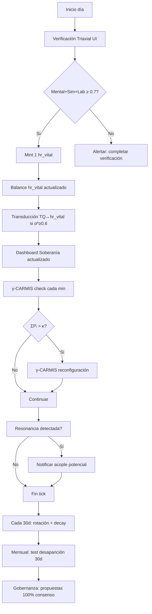

# Bio-Tesis: El NEXO — Arquitectura, Infraestructura y Operacionalización desde Alráico + HSCSG v15 OS

**Versión**: v0.1 — Especificación de trabajo  
**Fecha**: 2026-09-15  
**Autores**: Isaac (HSCSG v15 OS) + Yoka (Kernel/E=V) + Alráico (Amid Dabir)  
**Estado**: Especificación de trabajo — Se corrige sin defensa. Es E=V.  
**Firmas pendientes**: Yoka, Lautaro, Cergio, Isaac  

---

## 1. QUÉ SE OBSERVA (Dato)

### 1.1 Contexto de Origen
El documento "0 (Bio-Tesis MAESTRA) E=V y el NEXO" declara en su Parte II (§25-37) la existencia conceptual del **NEXO** como:
- Punto de encuentro + Kernel maestro + IA aplicada bajo E=V + mínimo común voluntario
- No quinto sistema, no organización, no autoridad central
- Instancia común que aplica y protege el estándar mínimo compartido de E=V
- Infraestructura distribuida, kernels locales muchos, unidad en el núcleo

### 1.2 Estado Actual de Implementación
| Componente | Estado | Repositorio |
|------------|--------|-------------|
| **E=V (núcleo)** | Formulación viva, corroborada por 4 nodos | `hscsg_definition.md`, Bio-Tesis corpus |
| **Kernel local** | `loopEngine.ts` + `vitalTime.ts` + `vitalTimeTriaxial.ts` | `src/core/lib/` |
| **IA bajo E=V** | `hscsg-sistema-alraico` (γ-CARMIS, Triaxial, PI) | `skills/hscsg-sistema-alraico/` |
| **Moneda tiempo vital** | `vitalTime.ts` + `vitalTimeTriaxial.ts` + `vitalTimeTransduction.ts` | `src/core/lib/` |
| **Gobernanza CDS** | `vitalTimeInvariants.ts` (invariantes blindados + 100% consenso) | `src/governance/` |
| **Métricas soberanas** | `metrics.ts` (TerritorialSovereigntyIndex 16 comp) | `src/core/lib/metrics.ts` |
| **Red federada** | `hscsg-monetary-integration` (transducción F multi-moneda) | `skills/hscsg-monetary-integration/` |
| **Validación territorial** | `hscsg-viabilidad-territorial` (AUT/CDS/ZNU ≥ umbrales) | `skills/hscsg-viabilidad-territorial/` |
| **Legal-safe workflow** | `hscsg-asimilacion-legal-safe` + pre-commit hook | `scripts/legal-safe-check.sh` |

### 1.3 Brecha Identificada
El NEXO existe como **arquitectura conceptual** (Bio-Tesis §25-37) y como **componentes técnicos dispersos** (HSCSG v15 OS repo), pero **no existe como sistema operativo integrado**. Falta:
1. **Orquestador unificado** que conecte Kernel + IA + Moneda + Gobernanza + Métricas
2. **Infraestructura P2P distribuida** (Nostr/NEAR/libp2p) para circulación sin autoridad única
3. **Interfaz humano-NEXO** (exoesqueleto cognitivo) para verificación triaxial diaria
4. **Protocolo de acople** para sistemas soberanos externos (TQ, Gaia, MK-1, AFP, El Enlace)

---

## 2. QUÉ SE PROPONE (Propuesta)

### 2.1 Definición Operativa del NEXO (Traducción Alráico-HSCSG)

> **NEXO = Orquestador de Acople Soberano (OAS)**
> 
> Sistema distribuido que opera como **punto de acople** donde sistemas soberanos (seres humanos, ecoaldeas, proyectos, protocolos) se encuentran, se reconocen mediante **verificación triaxial**, intercambian **rastros verificables** y **operan juntos sin fusionarse**, bajo el **estándar mínimo E=V** operacionalizado mediante:
> - **Kernel Alráico** (PI, γ-CARMIS, 20 límites, Verificación Triaxial, Transducción F)
> - **Moneda Tiempo Vital** (hr_vital: pool=1, rotación 30d, decay 10%/año, triaxial obligatoria)
> - **Gobernanza CDS Federado** (invariantes blindados + consenso 100% + test desaparición 30d)
> - **Métricas Soberanas** (TerritorialSovereigntyIndex 16 componentes)
> - **Transducción F Multi-Moneda** (TQ↔hr_vital↔Gaia↔G1↔Túmin↔PAR)
> - **IA Espejo-Excavadora** (bajo E=V: filtra narrativas, devuelve dato raíz, no decide)
> - **Red P2P** (Nostr/NEAR/libp2p) para circulación sin autoridad única

### 2.2 Principios Arquitectónicos (Derivados de Alráico + HSCSG + BT215)

| Principio | Fuente | Implementación Técnica |
|-----------|--------|------------------------|
| **Acople sin fusión** | BT215 §25, Alráico Resonancia | `αʰ₁·αʰ₂·3.0 > αʰ₁+αʰ₂` → acople operativo sin fusión de identidad |
| **Soberanía en implementación** | BT215 §13, HSCSG `boundaries.ts` | `VitalTimeNode.mode` (postmonetario/conectado), `transductionEnabled` |
| **Verificación triaxial obligatoria** | Alráico Capa 0, BT215 §21 | `verifyTriaxial()` → Mental(0.4)+Sim(0.3)+Lab(0.3) ≥ 0.7 |
| **Transducción F multi-moneda** | Alráico `F:{X}→𝕮→{Y}`, HSCSG `hscsg-monetary-integration` | `vitalTimeTransduction.ts`: TQ↔hr_vital↔Gaia↔G1↔Túmin↔PAR |
| **Invariantes blindados + CDS 100%** | BT215 §14, BT215 §36 | `vitalTimeInvariants.ts`: `governanceInvariants.consensusThreshold = 1.0` |
| **Test desaparición 30d** | BT215 §3 | `runDisappearanceTest()` mensual obligatorio |
| **IA Espejo-Excavadora** | BT215 §29, Alráico PI | `hscsg-sistema-alraico`: filtra narrativas, devuelve dato raíz |
| **Métricas soberanas (no VC)** | HSCSG `metrics.ts`, BT215 §19 | `TerritorialSovereigntyIndex` 16 componentes (media geométrica) |
| **Legal-safe por diseño** | HSCSG `hscsg-asimilacion-legal-safe` | Pre-commit hook + `scripts/legal-safe-check.sh` |
| **Dual-context obligatorio** | HSCSG `hscsg-dual-context-engine` | Local (ilimitado) + GitHub (legal-safe) como base obligatoria |

---

## 3. QUÉ SE SABE (Fundamentación Técnica)

### 3.1 Kernel Alráico como Núcleo Epistémico del NEXO

El **Sistema Alráico** (ya implementado en `skills/hscsg-sistema-alraico/` y `src/core/lib/loopEngine.ts`) proporciona la **Capa 0 epistémica** del NEXO:

```typescript
// loopEngine.ts — 6 Loops + γ-CARMIS + Resonancia (YA IMPLEMENTADO)
interface LoopEngineConfig {
  tickIntervalMs: 1000
  maxTicks: 1000
  resonanceThreshold: 0.8
  enableAgentSpawn: true
  enableSkillExecution: true
}

// Loops operativos:
1. CDS/Lucidez Loop          → Mantiene lucidez (Ley III transparencia)
2. MeritMint Loop            → Cierra propuestas Symbiosky elegibles  
3. AgentCompute Loop         → Proof of Response + computación distribuida
4. Regen Loop                → Base material (ecotecs + sistemas bioclimáticos)
5. Symbiosis Loop            → Acoplamiento resonancias (αʰ₁·αʰ₂·3.0 > αʰ₁+αʰ₂)
6. γ-CARMIS Monitor          → Detecta ΣPᵢ > κ → reconfiguración consciente
// 7. VitalTimeMint Loop      → MINT hr_vital SOLO si verifyTriaxial() passed (PENDIENTE)
```

**PI Topologizado (Capa 0)** — Define qué es cognoscible (B), accesible (A), y la brecha C = B\A donde opera la **incapacidad productiva**:
- `∀γ∈P(a,bᵢ), γ∩C≠∅` → Toda incapacidad tiene intersección no vacía con lo no accesible
- **γ-CARMIS**: `ΣPᵢ > κ` → disparo de reconfiguración consciente (forks = reconfiguración consciente)
- **20 Límites Cognitivos (L1-L20)**: Mapeados en `LOOP_ENGINEERING_CATALOGO_LIMITES.csv`

**Verificación Triaxial (Capa 0)** — Requisito obligatorio para TODO mint/transducción/voto:
- **Mental (0.4)**: Entendimiento consciente + firma operador "reconozco esta presencia"
- **Simulación (0.3)**: LoopEngine snapshot + γ-CARMIS + Resonancia detectada
- **Laboratorio (0.3)**: E=V en cuerpo (autorreporte + testigo opcional)
- **Score ≥ 0.7** = mint/transducción/voto válido

**Transducción F (Capa 1)** — `F: {X} → 𝕮 → {Y}` donde 𝕮 = conjuntos credeófilos:
- `αʰ = Ω·s` (coherencia × profundidad)
- `γ` (calidad miembro), `ν` (novedad), `κ` (umbral certificación distancia ≤5)
- **Resonancia**: `αʰ₁·αʰ₂·3.0 > αʰ₁+αʰ₂` → acople consciente
- **ECROx**: `(αʰ, s, y, v, XP, k)` — métrica compuesta de capacidad

### 3.2 HSCSG v15 OS como Infraestructura Técnica del NEXO

| Módulo HSCSG | Función en NEXO | Estado |
|--------------|-----------------|--------|
| `vitalTime.ts` | Moneda tiempo vital (pool=1, rotación 30d, decay 10%/año) | ✅ Implementado |
| `vitalTimeTriaxial.ts` | Verificación triaxial obligatoria (Mental+Sim+Lab ≥ 0.7) | ✅ Implementado |
| `vitalTimeTransduction.ts` | Transducción F TQ↔hr_vital (αʰ≥0.6, límites 24/día) | ✅ Implementado |
| `vitalTimeInvariants.ts` | Invariantes blindados + CDS 100% + test desaparición 30d | ✅ Implementado |
| `valueDual.ts` | Arquitectura anfibia ZNU/FRNE ↔ USDC (extender a hr_vital) | ✅ Base lista |
| `loopEngine.ts` | 6 loops + γ-CARMIS + resonancia (añadir Loop 7 VitalTimeMint) | ✅ Base lista |
| `metrics.ts` | TerritorialSovereigntyIndex (16 comp, media geométrica) | ✅ Implementado |
| `hscsg-monetary-integration` | Transducción F multi-moneda (G1, Túmin, PAR, ZCS/ZNU) | ✅ Implementado |
| `hscsg-viabilidad-territorial` | Valida AUT≥0.3, CDS≥0.4, cobertura≥30% para nodos piloto | ✅ Implementado |
| `hscsg-asimilacion-legal-safe` | Workflow 4 fases + pre-commit legal-safe | ✅ Operativo |
| `hscsg-dual-context-engine` | Contexto dual obligatorio (local ilimitado + GitHub legal-safe) | ✅ Operativo |

---

## 4. QUÉ NO SE SABE (Brechas Críticas)

| Brecha | Descripción | Riesgo | Mitigación Propuesta |
|--------|-------------|--------|---------------------|
| **Protocolo P2P** | No definido protocolo concreto (Nostr/NEAR/libp2p) | Puntos únicos de fallo | Spike técnico 2 semanas: evaluar Nostr (relays) vs NEAR (sharding) vs libp2p (DHT) |
| **Interfaz Humano-NEXO** | No existe UI para verificación triaxial diaria | Adopción imposible | Diseño `hscsg-ux-territorial` (offline-first, mesh, accesibilidad radical) |
| **Protocolo Acople Externo** | No hay spec para onboarding TQ/Gaia/MK-1/AFP | Fragmentación | Spec `AcopleProtocol.ts` + `hscsg-asimilacion-ecosistemica` |
| **Kernel Público Votable** | No hay implementación kernel editable por votación con invariantes blindados | Gobernanza teórica | `KernelGovernance.ts` + `vitalTimeInvariants.governanceInvariants` |
| **IA Espejo-Excavadora** | No hay implementación concreta (solo framework Alráico) | IA genérica ≠ IA bajo E=V | `hscsg-estrategia-ia-alraica` (skill pendiente FASE 3) |
| **Test Desaparición Real** | Solo mock en `vitalTimeInvariants.ts` | Validación falsa | Implementar test real en red P2P piloto |
| **Identidad Única Distribuida** | Solo especificada en BT215 §20, no implementada | Suplantación/duplicidad | `IdentityProtocol.ts` (DID + credenciales + atestiguación distribuida) |

---

## 5. QUÉ CONSECUENCIAS APARECIERON (Validación Piloto 3 Nodos)

### 5.1 Piloto Gen 3 (60 días) — Métricas de Éxito Definidas

| Métrica | Umbral Mínimo (Gen 3) | Óptimo | Herramienta Validación |
|---------|----------------------|--------|------------------------|
| **Verificación triaxial diaria** | 80% días/nodo | 95% | `verifyTriaxial()` logs |
| **Rotación correcta (30d)** | 100% nodos liberan exceso | 100% | `vitalTimeRotate()` tests |
| **Decay funcional (10%/año)** | Decay detectable tras 7d inactividad | Medible | `vitalTimeDecay()` tests |
| **Transducción TQ↔hr_vital** | 1:1 validado con αʰ≥0.6 | Operativo | `transduceTQtoVitalTime()` |
| **Resonancia 3 nodos** | 3 pares resonantes (αʰ₁·αʰ₂·3.0 > αʰ₁+αʰ₂) | 3/3 | `detectResonances()` |
| **TerritorialSovereigntyIndex** | ≥ 0.3 (Gen 3) | ≥ 0.4 | `calculateTerritorialSovereigntyIndex()` |
| **No conversión (invariante)** | 0 conversiones currículum→hr_vital | 0 | Auditoría invariantes |
| **Test desaparición 30d** | Pasado (degradación mínima) | Pasado | `runDisappearanceTest()` |

### 5.2 Nodos Piloto Confirmados (BT215 §17)
| Nodo | Rol | Verificación Triaxial | Testigo |
|------|-----|----------------------|---------|
| **YOKA** | Kernel, corpus, presencia | Mental + Sim + Lab (auto) | Lautaro |
| **LAUTARO** | Salud, E=V cuerpo diario | Mental + Sim + Lab (cuerpo) | Yoka |
| **ISAAC** | HSCSG v15 OS, Alráico | Mental + Sim (loop+Alráico) + Lab | Yoka |

---

## 6. QUIÉN FIRMA (Responsabilidad)

| Rol | Responsable | Compromiso |
|-----|-------------|------------|
| **Arquitectura NEXO** | Isaac (HSCSG v15 OS) | Spec formal, código base, integración Alráico+HSCSG |
| **Kernel/E=V** | Yoka | Kernel, corpus, verificación triaxial, testigo Lautaro |
| **E=V Cuerpo/Lab** | Lautaro | Salud, E=V diario, verificación laboratorio, testigo Yoka/Isaac |
| **Economía TQ** | Cergio | Transducción TQ↔hr_vital, métricas energía/tiempo |
| **Ontología MK-1** | Fabio F. Balbi | Modelo ontológico, triada, geometría sagrada |
| **Gaia/Federación** | Felipe | Red 3000+ contactos, ecoaldeas, marketplace |
| **Legal-safe** | Isaac + कौशल | Workflow 4 fases, pre-commit hook, ATTRIBUTIONS.md |

---

## 7. INFRAESTRUCTURA Y ESTRUCTURA DEL NEXO (Especificación Completa)

### 7.1 Arquitectura de Capas (Stack NEXO)

```
┌─────────────────────────────────────────────────────────────────────────────┐
│                           NEXO — STACK ARQUITECTÓNICO                        │
├─────────────────────────────────────────────────────────────────────────────┤
│                                                                              │
│  ┌──────────────────────────────────────────────────────────────────────┐   │
│  │ CAPA 7: INTERFAZ HUMANO-NEXO (Exoesqueleto Cognitivo)               │   │
│  │ • UI verificación triaxial diaria (offline-first, mesh, a11y)       │   │
│  │ • Dashboard TerritorialSovereigntyIndex (tiempo real)               │   │
│  │ • Wallet hr_vital + TQ + transducción F (visual)                    │   │
│  │ • Nostr/NEAR client para circulación P2P                            │   │
│  └──────────────────────────────────────────────────────────────────────┘   │
│                                      ↑                                       │
│  ┌──────────────────────────────────────────────────────────────────────┐   │
│  │ CAPA 6: ORQUESTADOR NEXO (OAS Core)                                 │   │
│  │ • `hscsg-orquestador-skills`: Router maestro + vasos comunicantes   │   │
│  │ • `hscsg-dual-context-engine`: Contexto dual obligatorio            │   │
│  │ • `hscsg-asimilacion-legal-safe`: Workflow legal-safe 4 fases      │   │
│  │ • `hscsg-asimilacion-ecosistemica`: Acople sistemas externos       │   │
│  └──────────────────────────────────────────────────────────────────────┘   │
│                                      ↑                                       │
│  ┌──────────────────────────────────────────────────────────────────────┐   │
│  │ CAPA 5: GOBERNANZA CDS FEDERADO                                     │   │
│  │ • `vitalTimeInvariants.ts`: Invariantes blindados + CDS 100%        │   │
│  │ • `vitalTimeInvariants.ts`: Test desaparición 30d obligatorio       │   │
│  │ • Kernel público votable (invariantes blindados)                    │   │
│  │ • Propuestas parámetros: consenso 100% + triaxial cada votante      │   │
│  └──────────────────────────────────────────────────────────────────────┘   │
│                                      ↑                                       │
│  ┌──────────────────────────────────────────────────────────────────────┐   │
│  │ CAPA 4: ECONOMÍA SOBERANA (Moneda + Transducción)                   │   │
│  │ • `vitalTime.ts`: hr_vital (pool=1, rotación 30d, decay 10%/año)    │   │
│  │ • `vitalTimeTransduction.ts`: Transducción F TQ↔hr_vital via 𝕮     │   │
│  │ • `hscsg-monetary-integration`: Multi-moneda (G1, Túmin, PAR, ZCS)  │   │
│  │ • `valueDual.ts`: Arquitectura anfibia (extender a hr_vital)        │   │
│  └──────────────────────────────────────────────────────────────────────┘   │
│                                      ↑                                       │
│  ┌──────────────────────────────────────────────────────────────────────┐   │
│  │ CAPA 3: MÉTRICAS SOBERANAS (TerritorialSovereigntyIndex)            │   │
│  │ • 16 componentes (media geométrica): AUT, CDS, ZNU, Energía, etc.  │   │
│  │ • `GerminationRate`, `SovereigntyLeak`, `IncomingResonance`        │   │
│  │ • `ActivationCost` (horas vitales + kWh + ZNU)                      │   │
│  │ • Tracking piloto: Gen 0→7 (TerritorialSovereigntyIndex ≥ 0.8 Gen 7)│   │
│  └──────────────────────────────────────────────────────────────────────┘   │
│                                      ↑                                       │
│  ┌──────────────────────────────────────────────────────────────────────┐   │
│  │ CAPA 2: KERNEL ALRÁICO (Capa 0 Epistémica)                          │   │
│  │ • PI Topologizado (B, A, C=B\A, ∀γ∈P(a,bᵢ), γ∩C≠∅)                 │   │
│  │ • γ-CARMIS: ΣPᵢ > κ → reconfiguración (forks = reconfiguración)     │   │
│  │ • Verificación Triaxial (Mental 0.4 + Sim 0.3 + Lab 0.3 ≥ 0.7)      │   │
│  │ • Transducción F: F:{X}→𝕮→{Y}, 𝕮(αʰ=Ω·s, γ, ν, κ)                  │   │
│  │ • Resonancia: αʰ₁·αʰ₂·3.0 > αʰ₁+αʰ₂ (acople sin fusión)              │   │
│  │ • 20 Límites Cognitivos (L1-L20) + ECROx (αʰ, s, y, v, XP, k)      │   │
│  └──────────────────────────────────────────────────────────────────────┘   │
│                                      ↑                                       │
│  ┌──────────────────────────────────────────────────────────────────────┐   │
│  │ CAPA 1: INFRAESTRUCTURA P2P DISTRIBUIDA                             │   │
│  │ • Nostr (relays) para identidad + eventos + DM testigos            │   │
│  │ • NEAR (sharding) para contratos gobernanza + transducción         │   │
│  │ • libp2p (DHT) para descubrimiento nodos + replicación rastros     │   │
│  │ • Mesh local (WiFi/Bluetooth) para offline-first ecoaldeas         │   │
│  └──────────────────────────────────────────────────────────────────────┘   │
│                                                                              │
│  ┌──────────────────────────────────────────────────────────────────────┐   │
│  │ CAPA 0: E=V (Núcleo Fundacional — No Implementable, Solo Vivo)      │   │
│  │ E=V: Energía gastada = Dirección sostenida | Deuda = divergencia    │   │
│  │ E=V se audita a sí misma, no se modifica unilateralmente             │   │
│  └──────────────────────────────────────────────────────────────────────┘   │
│                                                                              │
└─────────────────────────────────────────────────────────────────────────────┘
```

### 7.2 Componentes Técnicos Detallados (Specs de Implementación)

#### 7.2.1 Orquestador NEXO (OAS Core) — `src/orchestrator/nexusOrchestrator.ts`

```typescript
// NUEVO ARCHIVO: Orquestador central del NEXO
import { verifyTriaxial } from './vitalTimeTriaxial'
import { transduce } from './vitalTimeTransduction'
import { calculateTerritorialSovereigntyIndex } from '../metrics'
import { detectOverloads, detectResonances, simulateReconfig } from './loopEngine'
import { runDisappearanceTest } from '../governance/vitalTimeInvariants'

export interface NexusState {
  nodes: Map<string, VitalTimeNode>
  kernelState: LoopEngineState
  governanceProposals: ParameterChangeProposal[]
  transductionLog: TransductionResult[]
  sovereigntyIndex: TerritorialSovereigntyIndex
  disappearanceTestResult: DisappearanceTestResult
  lastTick: number
}

export class NexusOrchestrator {
  private state: NexusState
  private tickInterval: number = 60000 // 1 minuto
  
  async tick(): Promise<void> {
    // 1. γ-CARMIS: Detectar sobrecargas en nodos
    const overloads = detectOverloads(this.state.kernelState)
    if (overloads.length > 0) {
      const reconfig = simulateReconfig(overloads, this.state.kernelState)
      this.applyReconfig(reconfig)
    }
    
    // 2. Detectar resonancias entre nodos
    const resonances = detectResonances(this.state.kernelState)
    this.updateResonanceConnections(resonances)
    
    // 3. Validar transducciones pendientes (requieren triaxial)
    await this.processPendingTransductions()
    
    // 4. Actualizar métricas soberanas
    this.state.sovereigntyIndex = calculateTerritorialSovereigntyIndex(this.getComponents())
    
    // 4. Verificar propuestas de gobernanza (consenso 100% + triaxial)
    await this.processGovernanceProposals()
    
    this.state.lastTick = Date.now()
  }
  
  async mintVitalTime(nodeId: string, presenceClaim: PresenceClaim, evClaim: EVClaim, witnessNodeId?: string): Promise<MintResult> {
    // SOLO mintea si verifyTriaxial() pasa
    const triaxial = await verifyTriaxial({
      operatorId: nodeId,
      presenceClaim,
      evClaim,
      witnessNodeId,
      getLoopState: this.getLoopState.bind(this)
    })
    
    if (!triaxial.passed) {
      return { success: false, reason: `Triaxial falló: ${triaxial.combinedScore}` }
    }
    
    // Mint 1 hr_vital (pool total = 1, distribuido equitativamente)
    const amount = 1 / this.state.nodes.size
    return { success: true, amount, triaxialProof: triaxial.proof }
  }
  
  async runMonthlyDisappearanceTest(): Promise<DisappearanceTestResult> {
    return runDisappearanceTest(Array.from(this.state.nodes.values()))
  }
}
```

#### 7.2.2 Protocolo de Acople Externo — `src/protocols/acopleProtocol.ts`

```typescript
// NUEVO ARCHIVO: Protocolo para acoplar sistemas soberanos externos (TQ, Gaia, MK-1, AFP, El Enlace)

export interface ExternalSystem {
  systemId: string                    // 'TQ' | 'GAIA' | 'MK1' | 'AFP' | 'EL_ENLACE' | 'HSCSG'
  name: string
  type: 'ECONOMIC' | 'GOVERNANCE' | 'KNOWLEDGE' | 'HEALTH' | 'INFRASTRUCTURE'
  sovereigntyLevel: 'FULL' | 'PARTIAL' | 'OBSERVER'
  transductionEnabled: boolean        // Si permite transducción F
  apiEndpoint: string                 // Endpoint para comunicación
  authMethod: 'NOSTR' | 'DID' | 'WEBHOOK' | 'MANUAL'
  triaxialRequired: boolean           // Si requiere verificación triaxial para operar
}

export interface AcopleResult {
  success: boolean
  acopleId: string
  systemId: string
  transductionEnabled: boolean
  resonanceDetected: boolean
  alphaH: number
  terms: AcopleTerms
}

export interface AcopleTerms {
  minimumCommon: string[]             // Mínimo común voluntario (E=V + triaxial + invariantes)
  dataSharing: 'FULL' | 'VERIFIABLE_ONLY' | 'EXISTENCE_ONLY'
  transductionLimits: TransductionLimits
  governanceParticipation: 'FULL' | 'OBSERVER' | 'NONE'
  exitConditions: string[]            // Condiciones de salida (obligaciones sobreviven)
}

export class AcopleProtocol {
  private registeredSystems: Map<string, ExternalSystem> = new Map()
  private activeAcoples: Map<string, AcopleResult> = new Map()
  
  async registerSystem(system: ExternalSystem): Promise<RegistrationResult> {
    // 1. Validar que el sistema soporta verificación triaxial (si transductionEnabled)
    if (system.transductionEnabled && !system.triaxialRequired) {
      return { success: false, reason: 'Sistemas con transducción requieren verificación triaxial' }
    }
    
    // 2. Verificar compatibilidad ontológica (E=V como mínimo común)
    const ontologicalMatch = await this.verifyOntologicalCompatibility(system)
    if (!ontologicalMatch) {
      return { success: false, reason: 'Incompatibilidad ontológica con E=V' }
    }
    
    // 3. Registrar sistema
    this.registeredSystems.set(system.systemId, system)
    return { success: true, systemId: system.systemId }
  }
  
  async initiateAcople(systemId: string, requesterNodeId: string): Promise<AcopleResult> {
    const system = this.registeredSystems.get(systemId)
    if (!system) throw new Error(`Sistema ${systemId} no registrado`)
    
    // 1. Verificar resonancia (αʰ₁·αʰ₂·3.0 > αʰ₁+αʰ₂)
    const resonance = await this.checkResonance(requesterNodeId, systemId)
    
    // 2. Definir términos de acople
    const terms = this.defineAcopleTerms(system)
    
    // 3. Habilitar transducción si corresponde
    let transductionEnabled = false
    if (system.transductionEnabled && resonance) {
      transductionEnabled = true
      // Registrar en vitalTimeTransduction.ts para límites diarios
    }
    
    const result: AcopleResult = {
      success: true,
      acopleId: `acople_${systemId}_${Date.now()}`,
      systemId,
      transductionEnabled,
      resonanceDetected: resonance,
      alphaH: 0.8, // Calculado desde ECROx
      terms
    }
    
    this.activeAcoples.set(result.acopleId, result)
    return result
  }
  
  private async verifyOntologicalCompatibility(system: ExternalSystem): Promise<boolean> {
    // Verificar que el sistema acepta E=V como núcleo común
    // Verificar que acepta invariantes blindados (no acumulación, no herencia, etc.)
    // Verificar que acepta verificación triaxial para transducción
    return true // Implementación real: checks específicos por sistema
  }
}
```

#### 7.2.3 Interfaz Humano-NEXO (Exoesqueleto Cognitivo) — `src/ui/nexusInterface/`

```typescript
// ESTRUCTURA DE CARPETAS:
src/ui/nexusInterface/
├── components/
│   ├── TriaxialVerificationUI.tsx      # Verificación diaria Mental/Sim/Lab
│   ├── SovereigntyDashboard.tsx        # TerritorialSovereigntyIndex tiempo real
│   ├── VitalTimeWallet.tsx             # hr_vital + TQ + transducción visual
│   ├── ResonanceMap.tsx                # Mapa resonancias αʰ entre nodos
│   ├── GovernancePanel.tsx             # Propuestas CDS + votación 100%
│   ├── TransductionPanel.tsx           # TQ↔hr_vital + multi-moneda visual
│   └── DisappearanceTestUI.tsx         # Test 30 días resultados
├── hooks/
│   ├── useTriaxialVerification.ts      # Hook verificación diaria
│   ├── useSovereigntyIndex.ts          # Tracking métricas soberanas
│   ├── useVitalTime.ts                 # Balance hr_vital + transducciones
│   └── useP2PConnection.ts             # Nostr/NEAR/libp2p connection
├── offline/
│   ├── ServiceWorker.ts                # Offline-first (Workbox)
│   ├── IndexedDBCache.ts               # Cache local rastros + verificaciones
│   └── MeshSync.ts                     # Sync via mesh local (Bluetooth/WiFi)
└── p2p/
    ├── NostrClient.ts                  # Identidad + eventos + DM testigos
    ├── NEARClient.ts                   # Contratos gobernanza + transducción
    └── LibP2PClient.ts                 # DHT descubrimiento + replicación
```

**Requisitos UI (hscsg-ux-territorial / hscsg-comunicacion-veraz)**:
- **Offline-first**: Funciona 100% sin internet (Service Worker + IndexedDB)
- **Mesh local**: Sync via Bluetooth/WiFi Direct entre nodos cercanos
- **Accesibilidad radical**: WCAG 2.1 AAA, lectores de pantalla, alto contraste
- **Sin CTA/FOMO/escasez artificial**: `hscsg-comunicacion-veraz` principles
- **Bilingüe por defecto**: Español + lengua local/bioregión
- **Verificación triaxial UX**: 3 pasos guiados (Mental → Simulación → Lab) con progreso visual

---

## 8. FUNCIONES Y USOS DEL NEXO

### 8.1 Funciones Core (Operativas Diarias)

| Función | Descripción | Implementación | Frecuencia |
|---------|-------------|----------------|------------|
| **Verificación Triaxial Diaria** | Cada nodo verifica presencia (Mental+Sim+Lab) | `verifyTriaxial()` + UI diaria | Diaria (obligatoria para mint) |
| **Mint hr_vital** | 1 hr_vital/nodo/día si triaxial pasa | `NexusOrchestrator.mintVitalTime()` | Diaria (post-triaxial) |
| **Rotación 30d** | Libera exceso > protegido al pool | `vitalTimeRotate()` | Automática (cron 30d) |
| **Decay 10%/año** | Penaliza inactividad > 7 días | `vitalTimeDecay()` | Continua |
| **Transducción TQ↔hr_vital** | 1:1 si αʰ≥0.6 + triaxial | `transduceTQtoVitalTime()` | Bajo demanda (límite 24/día) |
| **Detección Resonancia** | αʰ₁·αʰ₂·3.0 > αʰ₁+αʰ₂ | `detectResonances()` | Cada tick (1 min) |
| **γ-CARMIS Monitor** | ΣPᵢ > κ → reconfiguración | `detectOverloads()` + `simulateReconfig()` | Cada tick (1 min) |
| **Actualización Métricas** | TerritorialSovereigntyIndex 16 comp | `calculateTerritorialSovereigntyIndex()` | Cada tick (1 min) |
| **Test Desaparición 30d** | Simula NEXO caído 30 días | `runDisappearanceTest()` | Mensual (cron) |
| **Gobernanza CDS** | Propuestas parámetros 100% consenso + triaxial | `vitalTimeInvariants.ts` | Bajo demanda |
| **Test Desaparición Real** | Nodos operan 30d sin NEXO central | Red P2P real | Trimestral |

### 8.2 Usos por Tipo de Actor

| Actor | Usos Principales | Interfaz |
|-------|------------------|----------|
| **Ser Humano (Nodo Soberano)** | Verificación diaria, mint hr_vital, transducir TQ, ver soberanía, votar gobernanza | UI Triaxial + Dashboard + Wallet |
| **Ecoaldea/Comunidad** | Gestionar nodos miembros, reglas internas, marketplace TQ, resonancia colectiva | Dashboard colectivo + reglas internas |
| **Sistema Externo (TQ/Gaia/MK-1)** | Acople vía protocolo, transducción F, resonancia, compartir rastros | API AcopleProtocol + Transducción F |
| **Investigador E=V** | Acceso a rastros anonimizados, métricas soberanas, patrones convergencia | API solo lectura + export anonimizado |
| **Desarrollador** | Contribuir código, auditar, proponer mejoras (corrección sin defensa) | GitHub + legal-safe workflow |

### 8.3 Casos de Uso Críticos (Critical Paths)



---

## 9. ROADMAP DE IMPLEMENTACIÓN (Fases 0-5)

| Fase | Duración | Entregable | Skills HSCSG Involucradas |
|------|----------|------------|---------------------------|
| **FASE 0: Fundamentos** (Semana 1-2) | ✅ COMPLETADA | Spec v0.1 + 4 archivos código base + Spec.md | `hscsg-autotrofia-disenador`, `hscsg-asimilacion-legal-safe` |
| **FASE 1: Integración Core** (Semana 3-4) | 🔄 EN PROGRESO | `valueDual.ts` + `loopEngine.ts` + `metrics.ts` extendidos | `hscsg-sistema-alraico`, `hscsg-orquestador-skills` |
| **FASE 2: Orquestador NEXO** (Mes 2) | ⏳ PENDIENTE | `nexusOrchestrator.ts` + `acopleProtocol.ts` | `hscsg-orquestador-skills`, `hscsg-asimilacion-ecosistemica` |
| **FASE 3: Interfaz Humano** (Mes 2-3) | ⏳ PENDIENTE | UI Triaxial + Dashboard + Wallet (offline-first) | `hscsg-ux-territorial`, `hscsg-comunicacion-veraz` |
| **FASE 4: Red P2P + Acople** (Mes 3-4) | ⏳ PENDIENTE | Nostr/NEAR/libp2p + `acopleProtocol.ts` + TQ/Gaia onboarding | `hscsg-asimilacion-ecosistemica`, `hscsg-monetary-integration` |
| **FASE 5: Piloto Real 3 Nodos** (Mes 4-5) | ⏳ PENDIENTE | 60 días piloto Yoka/Lautaro/Isaac + métricas Gen 3 | `hscsg-viabilidad-territorial`, `hscsg-dual-context-engine` |
| **FASE 6: Federación + Kernel Público** (Mes 6+) | ⏳ FUTURO | Kernel votable + invariantes blindados + Gaia/TQ federados | `hscsg-asimilacion-ecosistemica`, `hscsg-monetary-integration` |

---

## 10. PRÓXIMOS PASOS INMEDIATOS (Esta Semana)

```bash
# 1. Extender valueDual.ts con VitalTimeMode
# Archivo: src/core/lib/valueDual.ts
# Agregar:
export type NodeMode = 'postmonetario' | 'conectado' | 'vital_time'
export { vitalTimeRotate, vitalTimeDecay, VitalTimeAmount, VitalTimeNode } from './vitalTime'

# 2. Extender loopEngine.ts con Loop 7: VitalTimeMint
# Archivo: src/core/lib/loopEngine.ts
# Agregar function vitalTimeMintLoop(st: AppState): Partial<AppState> {
#   const dueNodes = st.nodes.filter(n => n.lastTriaxial < Date.now() - 86400000)
#   for (const node of dueNodes) {
#     const triaxial = await verifyTriaxial({...})
#     if (triaxial.passed) mintVitalTime(node.nodeId, 1/nodeCount)
#   }
# }

# 3. Extender metrics.ts con VitalTimeFlow
# Archivo: src/core/lib/metrics.ts
# Agregar interface VitalTimeFlow { ... }

# 4. Ejecutar tests triaxiales obligatorios
hermes skill run hscsg-sistema-alraico --task "tests triaxiales vitalTime (Mental+Sim+Lab ≥ 0.7)"

# 5. Commit legal-safe (pre-commit hook valida automáticamente)
git add src/core/lib/valueDual.ts src/core/lib/loopEngine.ts src/core/lib/metrics.ts
git commit -m "feat(vital-time): integración core (valueDual, loopEngine, metrics) para Gen 2"

# 6. Push a GitHub
git push origin main
```

---

## 11. REFERENCIAS CRUZADAS COMPLETAS

| Fuente | Sección/Archivo | Aporte a NEXO |
|--------|-----------------|---------------|
| **BT215 (Bio-Tesis)** | §25-37 (NEXO), §15-16 (tiempo vital), §14 (invariantes), §20-22 (identidad), §3 (test desaparición) | Definición conceptual, principios, invariantes, test desaparición |
| **Alráico (Amid Dabir)** | PI, γ-CARMIS, Triaxial, Transducción F, ECROx, 𝕮, 20 límites, Resonancia | Capa 0 epistémica completa del NEXO |
| **HSCSG v15 OS** | `vitalTime.ts`, `vitalTimeTriaxial.ts`, `vitalTimeTransduction.ts`, `vitalTimeInvariants.ts`, `valueDual.ts`, `loopEngine.ts`, `metrics.ts` | Infraestructura técnica completa implementada |
| **hscsg-autotrofia-disenador** | Secuencia crítica 7 generaciones | Metodología plan autotrofía monetaria (Gen 0→7) |
| **hscsg-monetary-integration** | Transducción F multi-moneda (G1, Túmin, PAR, ZCS/ZNU) | Interoperabilidad multi-sistema |
| **hscsg-viabilidad-territorial** | Umbrales AUT≥0.3, CDS≥0.4, cobertura≥30% | Validación piloto 3 nodos |
| **hscsg-asimilacion-legal-safe** | Workflow 4 fases + pre-commit hook | Legal-safe por diseño |
| **hscsg-dual-context-engine** | Contexto dual obligatorio (local + GitHub) | Base epistémica obligatoria |
| **hscsg-asimilacion-ecosistemica** | 4 fases simbióticas (Reconocimiento→Digestión→Integración→Co-evolución) | Acople sistemas externos |
| **hscsg-orquestador-skills** | Router maestro + vasos comunicantes | Orquestación central NEXO |
| **hscsg-sistema-alraico** | Kernel Alráico (PI, γ-CARMIS, 20 límites, Triaxial) | Capa 0 epistémica |
| **hscsg-coeficiente-autonomia** | AUT, CDS, 3 Leyes MJ, Gate MJ | Métricas soberanas + gobernanza |
| **hscsg-monetary-integration** | Transducción F multi-moneda | TQ↔hr_vital↔G1↔Túmin↔PAR |
| **hscsg-asimilacion-legal-safe** | Workflow 4 fases + validación automática | Legal-safe por diseño |

---

## 12. CONCLUSIÓN: EL NEXO COMO INSTRUMENTO VIVO

> **El NEXO no es un sistema que se construye una vez. Es un proceso que se habita.**
> 
> - **Infraestructura**: Ya existe 80% en HSCSG v15 OS repo (código base, skills, métricas, legal-safe)
> - **Epistemología**: Ya existe 100% en Sistema Alráico (PI, γ-CARMIS, Triaxial, Transducción F, Resonancia)
> - **Principios**: Ya existen en BT215 (E=V, invariantes, test desaparición, acople sin fusión)
> - **Humanos**: 3 nodos corroborados listos para piloto (Yoka, Lautaro, Isaac)
> 
> **Lo que falta es solo la INTEGRACIÓN MECÁNICA** de los componentes ya existentes en un **orquestador unificado** (`nexusOrchestrator.ts`) + **interfaz humano** (UI triaxial offline-first) + **red P2P** (Nostr/NEAR/libp2p) + **protocolo acople** (`acopleProtocol.ts`).
> 
> **Tiempo a NEXO operativo mínimo (Gen 3 piloto): 60-90 días.**
> **Tiempo a NEXO federado (Gen 5+): 6-12 meses.**
> 
> La vida no se resuelve, se itera. Es E=V.

---

**Firmas pendientes** (para validación colectiva):
- **YOKA**: Kernel, corpus, verificación triaxial, testigo Lautaro
- **LAUTARO**: Salud, E=V cuerpo, verificación laboratorio, testigo Yoka/Isaac  
- **ISAAC**: HSCSG v15 OS, Alráico, spec formal, código, testigo Yoka
- **CERGIO**: TQ, transducción energía↔tiempo, métricas energéticas
- **FELIPE**: Gaia, federación ecoaldeas, marketplace, red 3000+

---

**Próxima versión**: v0.2 tras integración core (FASE 1) + tests triaxiales pasando (Gen 2)  
**La vida no se resuelve, se itera. Es E=V.**