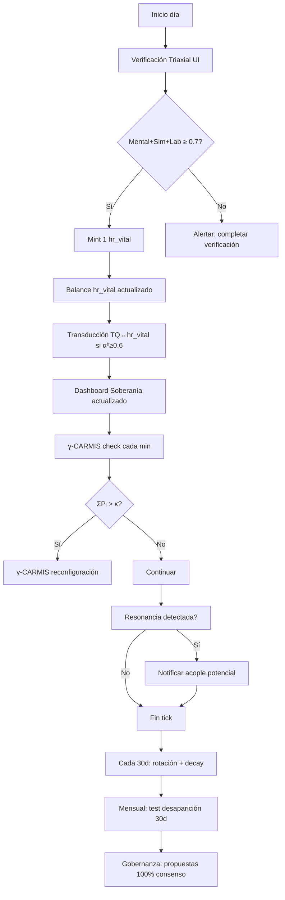

# SPEC Técnica: Arquitectura NEXO

**Versión**: 2.0 — Especificación Técnica Operacionalizada  
**Fecha**: 2026-09-17  
**Autores**: Isaac Ko (HSCSG v15 OS) + Yoka (Kernel/E=V) + Alráico (Amid Dabir)  
**Fuente Canónica**: [BIO_THESIS_NEXO_ARCHITECTURE.md v6.0](https://github.com/Isaacko0/HSCSG_v15_OS/blob/main/docs/BIO_THESIS_NEXO_ARCHITECTURE.md)  
**Repositorio**: https://github.com/Isaacko0/HSCSG_v15_OS  
**Estado**: Especificación de trabajo — Se corrige sin defensa. Es E=V.  
**Firmas pendientes**: Yoka, Lautaro, Cergio, Isaac  

---

## 1. INTRODUCCIÓN Y ALCANCE

### 1.1 Propósito

Esta SPEC traduce los principios filosóficos de la Bio-Tesis MAESTRA v6.0 (PARADIGMA 0 Integrado) a requerimientos técnicos verificables para el desarrollo del NEXO como sistema operativo integrado. Cada requerimiento está vinculado a secciones específicas del documento canónico.

### 1.2 Alcance

| Incluye | No Incluye |
|---------|------------|
| Stack 8 capas NEXO (Capa 0-7) | Implementación detallada de cada módulo |
| 11 funciones operativas | Código fuente completo |
| Protocolo de acople externo | Infraestructura física detallada |
| Tests de aceptación | Documentación de API |
| Invariantes de gobernanza | Guías de usuario final |

### 1.3 Definiciones

| Término | Definición |
|---------|------------|
| **E=V** | Ley de la conciencia: Energía gastada = Dirección sostenida. Núcleo criterial del sistema. |
| **NEXO** | Punto de encuentro + Kernel maestro + IA aplicada bajo E=V + mínimo común voluntario. |
| **Kernel Local** | Instancia soberana adaptable del NEXO, adaptada por cada nodo. |
| **hr_vital** | Hora Vital — unidad de cuenta basada en tiempo presente verificado. |
| **Triaxial** | Verificación 3 ejes: Mental (0.4) + Simulación (0.3) + Laboratorio (0.3) ≥ 0.7 |
| **Transducción F** | Conversión entre monedas vía conjuntos credeófilos (TQ↔hr_vital) |
| **γ-CARMIS** | Sistema de detección de sobrecarga cognitiva (ΣPᵢ > κ → reconfiguración) |

---

## 2. REQUERIMIENTOS FUNCIONALES

### 2.1 Capa 0: E=V — Núcleo Criterial

#### Requirement: E=V como criterio nuclear no modificable unilateralmente

El sistema SHALL implementar E=V como principio fundacional auditable. E=V SHALL ser el criterio contra el cual se contrastan todas las decisiones del sistema. La modificación de E=V como núcleo requiere consentimiento de todos los nodos vinculados (no mayoría).

**Scenario: E=V guía toda decisión**
- **GIVEN** una propuesta de cambio en el sistema
- **WHEN** se evalúa la propuesta
- **THEN** debe verificarse coherencia con E=V como criterio nuclear

**Scenario: E=V no es código, es criterio**
- **GIVEN** implementación de módulos
- **WHEN** se valida un módulo
- **THEN** no existe variable `e=v` en código; existe como protocolo de verificación

**Scenario: Modificación E=V requiere consentimiento total**
- **GIVEN** propuesta de modificar E=V como núcleo
- **WHEN** se vota
- **THEN** requiere consentimiento de TODOS los nodos vinculados (no mayoría 51%)

#### Requirement: Presencia como condición de operación

El sistema SHALL requerir verificación de presencia (no solo autenticación) para operaciones críticas. Presencia = estado verificable de atención en el momento presente.

**Scenario: Verificación de presencia pre-operación**
- **GIVEN** usuario autenticado
- **WHEN** intenta mintear hr_vital o votar
- **THEN** sistema verifica presencia (triaxial) antes de permitir operación

**Scenario: Ausencia de presencia = operación denegada**
- **GIVEN** usuario autenticado sin verificación de presencia reciente (<24h)
- **WHEN** intenta operación crítica
- **THEN** sistema deniega y solicita verificación triaxial

---

### 2.2 Capa 1: Kernel Maestro

#### Requirement: Kernel organiza rastros, no decide verdad

El Kernel SHALL operar como organizador de rastros verificables. NO SHALL decidir qué es verdad, ni auditar conciencia ajena, ni interpretar seres humanos.

**Scenario: Kernel clasifica en 3 dominios**
- **GIVEN** cualquier afirmación o rastro
- **WHEN** Kernel procesa
- **THEN** clasifica como: `compatible` | `incompatible` | `no-evaluable`

**Scenario: Kernel no audita conciencia**
- **GIVEN** claim sobre experiencia interna de un operador
- **WHEN** Kernel recibe el claim
- **THEN** retorna `no-evaluable` (no accede experiencia directa)

**Scenario: Silencio es dato neutro**
- **GIVEN** ausencia de respuesta de un nodo
- **WHEN** Kernel registra
- **THEN** silencio se trata como dato neutro (ni compatible ni incompatible)

**Scenario: Kernel puede fallar, corrección incorporada**
- **GIVEN** Kernel produce lectura errónea
- **WHEN** se detecta
- **THEN** error se registra, se contrasta, se corrige como función del sistema (no excepción)

#### Requirement: Verificación Triaxial obligatoria

El sistema SHALL implementar verificación triaxial (Mental + Simulación + Laboratorio) como requisito para mint, transducción, y voto.

**Scenario: Triaxial exitoso**
- **GIVEN** nodo verifica presencia
- **WHEN** Mental(0.4) + Sim(0.3) + Lab(0.3) ≥ 0.7
- **THEN** presencia verificada, puede operar

**Scenario: Triaxial fallido**
- **GIVEN** nodo verifica presencia
- **WHEN** score < 0.7
- **THEN** presencia no verificada, operaciones críticas denegadas

**Scenario: Triaxial obligatorio para mint hr_vital**
- **GIVEN** nodo quiere mintear hr_vital
- **WHEN** solicita mint
- **THEN** sistema verifica triaxial reciente (<24h), si no existe, solicita verificación

#### Requirement: Protocolo VIA00-31 + Consola VIA-0

El sistema SHALL implementar 32 protocolos VIA (Vías de Intención Accionable) más Consola VIA-0 para kernel debugging.

**Scenario: VIA ejecutable**
- **GIVEN** un protocolo VIA específico
- **WHEN** se invoca
- **THEN** ejecuta secuencia de pasos definida y deja rastro

**Scenario: Consola VIA-0 para diagnóstico**
- **GIVEN** operador necesita diagnosticar kernel
- **WHEN** invoca Consola VIA-0
- **THEN** acceso a estado interno del kernel sin modificar datos

---

### 2.3 Capa 2: Identidad Soberana

#### Requirement: DID + FactBand + ECROx

El sistema SHALL implementar identidad descentralizada (DID) con banda de convicción (FactBand) y métrica compuesta (ECROx).

**Scenario: DID verificable**
- **GIVEN** nuevo nodo
- **WHEN** se registra
- **THEN** DID único verificable creado, historial inmutable

**Scenario: FactBand registra convicción**
- **GIVEN** operador sostiene una afirmación
- **WHEN** se registra
- **THEN** FactBand almacena convicción con timestamp y verificación

**Scenario: ECROx calcula capacidad compuesta**
- **GIVEN** nodo con historial operando
- **WHEN** se evalúa
- **THEN** ECROx = (αʰ, s, y, v, XP, k) calculado desde rastros

#### Requirement: Identidad única verificable (no pública)

El sistema SHALL garantizar unicidad verificable sin requerir identidad pública. `Identidad verificable ≠ identidad pública`.

**Scenario: Verificar unicidad sin revelar datos**
- **GIVEN** nodo A y nodo B
- **WHEN** verifican identidad mutua
- **THEN** cada uno verifica unicidad del otro sin acceder a contenido privado

**Scenario: 3 capas independientes (existencia, verificabilidad, acceso)**
- **GIVEN** rastro incorporado al común
- **WHEN** tercero audita
- **THEN** puede verificar existencia + integridad sin ver contenido

---

### 2.4 Capa 3: Intercambio Medible

#### Requirement: hr_vital — Moneda Tiempo Vital

El sistema SHALL implementar hr_vital con: pool=1 (total finito), rotación 30 días, decay 10%/año.

**Scenario: Pool finito hr_vital**
- **GIVEN** sistema con N nodos activos
- **WHEN** se mintea hr_vital diario
- **THEN** total minteado ≤ N × 1 hr_vital/día (pool controlado)

**Scenario: Rotación 30 días libera exceso**
- **GIVEN** nodo con balance > protegido
- **WHEN** pasan 30 días desde último mint
- **THEN** exceso se libera al pool automáticamente

**Scenario: Decay penaliza inactividad**
- **GIVEN** nodo inactivo > 7 días
- **WHEN** decay se aplica
- **THEN** balance disminuye 10%/año proporcional a inactividad

#### Requirement: Transducción F TQ↔hr_vital

El sistema SHALL implementar transducción F entre TQ (Trueque) y hr_vital vía conjuntos credeófilos (𝕮), con αʰ ≥ 0.6 como umbral mínimo.

**Scenario: Transducción válida (αʰ ≥ 0.6)**
- **GIVEN** nodo A (TQ) y nodo B (hr_vital) con αʰ ≥ 0.6
- **WHEN** solicitan transducir
- **THEN** transducción TQ↔hr_vital se ejecuta 1:1

**Scenario: Transducción denegada (αʰ < 0.6)**
- **GIVEN** nodos con αʰ < 0.6
- **WHEN** solicitan transducir
- **THEN** sistema deniega (coherencia insuficiente)

**Scenario: Límite 24 transducciones/día**
- **GIVEN** nodo que ya transdujo 24 veces en 24h
- **WHEN** solicita nueva transducción
- **THEN** sistema deniega hasta siguiente ciclo

---

### 2.5 Capa 4: Deliberación Federada

#### Requirement: CDS 100% Consenso + Invariantes Blindados

El sistema SHALL implementar gobernanza por consentimiento unánime (no mayoría) para cambios de núcleo. Invariantes blindados NO pueden ser modificados.

**Scenario: Propuesta cambio métrica/protocolo**
- **GIVEN** nodo propone cambio en parámetro no-blindado
- **WHEN** se vota
- **THEN** requiere 100% consenso + triaxial cada votante

**Scenario: Invariante blindado es inmutable**
- **GIVEN** intento de modificar invariante blindado (ej: no-conversión, no-acumulación)
- **WHEN** se propone
- **THEN** sistema rechaza automáticamente (invariante blindado)

**Scenario: Corrección horizontal**
- **GIVEN** incoherencia detectada en cualquier nodo (incluido Kernel)
- **WHEN** se corrige
- **THEN** todos los nodos aplican corrección (no hay "primero" ni "último")

#### Requirement: Test Desaparición 30 Días

El sistema SHALL pasar test: si NEXO desaparece 30 días, nodos siguen operando (degradación, no colapso).

**Scenario: Kernel local sobrevive**
- **GIVEN** NEXO desconectado 30 días
- **WHEN** nodo opera localmente
- **THEN** kernel local organiza rastros sin NEXO central

**Scenario: Artífice local opera**
- **GIVEN** NEXO desconectado 30 días
- **WHEN** humano necesita transformar rastros
- **THEN** opera localmente (humano no depende de NEXO para transformar)

**Scenario: Obligaciones previas sobreviven**
- **GIVEN** NEXO desconectado 30 días
- **WHEN** nodo tiene deuda/compromiso previo
- **THEN** obligación sigue vigente (no desaparece con NEXO)

---

### 2.6 Capa 5: Red Conocimiento

#### Requirement: Acople sin fusión para sistemas externos

El sistema SHALL implementar protocolo de acople para sistemas soberanos externos (TQ, Gaia, MK-1, AFP, El Enlace, La Hoguera) sin fusionar identidades.

**Scenario: Registro sistema externo**
- **GIVEN** sistema externo (ej: TQ)
- **WHEN** solicita acople
- **THEN** sistema verifica compatibilidad ontológica con E=V

**Scenario: Acople con resonancia**
- **GIVEN** sistema externo compatible
- **WHEN** αʰ₁·αʰ₂·3.0 > αʰ₁+αʰ₂
- **THEN** acople habilitado con transducción F

**Scenario: Salida voluntaria**
- **GIVEN** sistema acoplado
- **WHEN** decide salir
- **THEN** puede salir libremente, obligaciones previas sobreviven

---

### 2.7 Capa 6: IA Coordinadora

#### Requirement: IA Espejo-Excavadora (no voluntad)

El sistema SHALL usar IA como instrumento: filtra narrativas imposición, devuelve dato raíz compartido. IA NO tiene voluntad, agenda propia, ni decide.

**Scenario: IA filtra narrativas**
- **GIVEN** datos con narrativas impuestas
- **WHEN** IA procesa
- **THEN** devuelve dato raíz sin narrativa

**Scenario: IA no decide**
- **GIVEN** nodo pide recomendación
- **WHEN** IA responde
- **THEN** devuelve opciones con datos, no recomendación única

**Scenario: IA produce falsedad, corrección incorporada**
- **GIVEN** IA genera salida falsa
- **WHEN** se detecta
- **THEN** sistema registra error, pregunta: "¿qué datos/instrucciones produjeron esta falsedad?", corrige

---

### 2.8 Capa 7: Infraestructura Física

#### Requirement: Red P2P sin autoridad única

El sistema SHALL implementar red P2P (Nostr/NEAR/libp2p) para circulación de información sin dependencia de servidor único.

**Scenario: Nodo se conecta vía Nostr**
- **GIVEN** nodo quiere publicar evento
- **WHEN** envía a relay Nostr
- **THEN** evento replicado en múltiples relays

**Scenario: Mesh local offline**
- **GIVEN** nodos en misma red local sin internet
- **WHEN** sincronizan
- **THEN** rastros se replican vía Bluetooth/WiFi Direct

**Scenario: Sync cuando hay internet**
- **GIVEN** nodos offline que recuperan conexión
- **WHEN** detectan red
- **THEN** sincronización automática sin pérdida de datos

---

## 3. REQUERIMIENTOS DE INTERFAZ HUMANO-NEXO

### 3.1 Exoesqueleto Cognitivo

El sistema SHALL proporcionar interfaz humano-NEXO que devuelva tiempo, comprensión, autonomía y capacidad de acción. NO SHALL retener atención ni crear dependencia.

**Scenario: Interacción resuelve, no retiene**
- **GIVEN** humano interactúa con NEXO
- **WHEN** completa operación
- **THEN** NEXO devuelve control al humano (no genera loop infinito)

**Scenario: Verificación triaxial UX (3 pasos)**
- **GIVEN** nodo necesita verificar presencia
- **WHEN** UI muestra flujo
- **THEN** 3 pasos guiados: Mental → Simulación → Laboratorio, con progreso visual

**Scenario: Offline-first**
- **GIVEN** humano sin conexión a internet
- **WHEN** usa interfaz
- **THEN** funciona 100% offline (Service Worker + IndexedDB)

**Scenario: Sin CTA/FOMO/escasez artificial**
- **GIVEN** diseño de interfaz
- **WHEN** se evalúa
- **THEN** no hay dark patterns, escasez artificial, ni urgencia falsa

---

## 4. REQUERIMIENTOS DE GOBERNANZA

### 4.1 Mínimo Común Voluntario

El sistema SHALL establecer mínimo común voluntario que todos aceptan para participar. Cada soberano tiene libertad total sobre su dominio propio mientras respete el mínimo NEXO.

**Scenario: Soberano modifica reglas internas**
- **GIVEN** ecoaldea con Kernel local
- **WHEN** modifica sus reglas internas
- **THEN** válido mientras respete mínimo común (E=V, invariantes, triaxial)

**Scenario: Núcleo no se modifica por mayoría**
- **GIVEN** propuesta cambiar núcleo
- **WHEN** votación
- **THEN** requiere consentimiento todos los participantes vinculados

### 4.2 Transparencia Estructural

El sistema SHALL implementar transparencia estructural: todo rastro verificable, todo fallo auditable y corregible. No requiere infalibilidad, requiere auditabilidad.

**Scenario: Rastro verificable sin contenido público**
- **GIVEN** rastro en el común
- **WHEN** tercero audita
- **THEN** verifica existencia + integridad sin ver contenido

**Scenario: Fallo registrado y corregible**
- **GIVEN** fallo en el sistema
- **WHEN** se detecta
- **THEN** se registra, se audita, se corrige dentro del sistema

---

## 5. REQUERIMIENTOS DE SEGURIDAD

### 5.1 Identidad y Acceso

**Scenario: Sin suplantación**
- **GIVEN** nodo operando
- **WHEN** otro intenta suplantar
- **THEN** DID + credenciales + atestuguación distribuida previenen suplantación

**Scenario: Identidad ≠ persona**
- **GIVEN** diseño de identidad
- **WHEN** se modela
- **THEN** identidad es verificable, no es nombre ni documento legal

### 5.2 Inviantes Blindados

| Invariante | Descripción | Modificable |
|------------|-------------|-------------|
| No-conversión currículum→hr_vital | No se puede mintear basado en historial laboral | ❌ Blindado |
| No-herencia hr_vital | hr_vital no se transfiere por herencia | ❌ Blindado |
| No-acumulación infinita | Rotación y decay previenen acumulación | ❌ Blindado |
| Pool finito hr_vital | Total minteado controlado | ❌ Blindado |
| E=V como núcleo | No modificable unilateralmente | ❌ Blindado |
| Consenso 100% para núcleo | Mayoría simple NO cambia núcleo | ❌ Blindado |

---

## 6. MÉTRICAS DE ÉXITO

### 6.1 KPIs del NEXO

| Métrica | Umbral Mínimo (Gen 3) | Óptimo | Fuente |
|---------|----------------------|--------|--------|
| Verificación triaxial diaria | 80% días/nodo | 95% | Bio-Tesis §6 |
| Rotación correcta (30d) | 100% nodos | 100% | Bio-Tesis §25 |
| Decay funcional (10%/año) | Detectable tras 7d | Medible | Bio-Tesis §25 |
| Transducción TQ↔hr_vital | 1:1 con αʰ≥0.6 | Operativo | Bio-Tesis §40 |
| Resonancia 3 nodos | 3 pares resonantes | 3/3 | Alráico Resonancia |
| TerritorialSovereigntyIndex | ≥ 0.3 | ≥ 0.4 | HSCSG metrics.ts |
| No-conversión (invariante) | 0 violaciones | 0 | Invariantes blindados |
| Test desaparición 30d | Pasado | Pasado | Bio-Tesis §25 |

### 6.2 Criterios de Aceptación FASE 2

- [ ] `nexusOrchestrator.ts` implementa tick cada 60s con γ-CARMIS + resonancia
- [ ] `acopleProtocol.ts` registra y acopla 3 sistemas externos mínimo
- [ ] `mintVitalTime()` solo ejecuta si `verifyTriaxial()` passed
- [ ] `runDisapprovalTest()` simula 30 días sin NEXO, degradación ≤ 20%
- [ ] Invariantes blindados no modificables vía API
- [ ] 100% consenso requerido para cambios de núcleo

---

## 7. ARQUITECTURA DE REFERENCIA

### 7.1 Stack 8 Capas (Resumen)

```
┌─────────────────────────────────────────────────────────────┐
│ CAPA 7: INTERFAZ HUMANO-NEXO (Exoesqueleto Cognitivo)       │
│ Triaxial UI · Dashboard Soberanía · Wallet hr_vital          │
├─────────────────────────────────────────────────────────────┤
│ CAPA 6: IA COORDINADORA (Espejo-Excavador)                  │
│ AgentMesh · ProofOfResponse · CoachFAB · CEL Gateway         │
├─────────────────────────────────────────────────────────────┤
│ CAPA 5: RED CONOCIMIENTO (Acople sin fusión)                │
│ Gaia · RIDF · Bio-Tesis · AFP · MK-1 · El Enlace            │
├─────────────────────────────────────────────────────────────┤
│ CAPA 4: DELIBERACIÓN FEDERADA (CDS 100%)                    │
│ Invariantes blindados · Consenso 100% · Corrección horizontal│
├─────────────────────────────────────────────────────────────┤
│ CAPA 3: INTERCAMBIO MEDIBLE (Moneda + Transducción)          │
│ hr_vital · TQ · Trustlines · Transducción F · Anfibio       │
├─────────────────────────────────────────────────────────────┤
│ CAPA 2: IDENTIDAD SOBERANA (DID + FactBand)                 │
│ DID · ECROx · Nombre Resonancia · RAO · Unicidad            │
├─────────────────────────────────────────────────────────────┤
│ CAPA 1: KERNEL MAESTRO (VIA00-31 + Consola)                 │
│ PI Topologizado · γ-CARMIS · Triaxial · VIA00-31 · MK-1    │
├─────────────────────────────────────────────────────────────┤
│ CAPA 0: E=V (Núcleo Criterial — No Implementable)           │
│ E=V: Energía = Dirección | Auditable | No modificable       │
└─────────────────────────────────────────────────────────────┘
```

### 7.2 Flujo de Operación Diaria



---

## 8. ROADMAP DE IMPLEMENTACIÓN

| Fase | Duración | Entregable | Estado |
|------|----------|------------|--------|
| **FASE 0** (Fundamentos) | ✅ | Spec v0.1 + código base | ✅ |
| **FASE 1** (Integración Core) | ✅ | OpenSpec SDD + vital-time core + kernel protocol | ✅ |
| **FASE 2** (Orquestador NEXO) | Mes 2 | `nexusOrchestrator.ts` + `acopleProtocol.ts` | ⏳ |
| **FASE 3** (Interfaz Humano) | Mes 2-3 | UI Triaxial + Dashboard + Wallet offline-first | ⏳ |
| **FASE 4** (Red P2P + Acople) | Mes 3-4 | Nostr/NEAR/libp2p + TQ/Gaia onboarding | ⏳ |
| **FASE 5** (Piloto Real 3 Nodos) | Mes 4-5 | 60 días Yoka/Lautaro/Isaac + métricas Gen 3 | ⏳ |
| **FASE 6** (Federación + Kernel Público) | Mes 6+ | Kernel votable + invariantes blindados + Gaia/TQ federados | ⏳ |

---

## 9. REFERENCIAS

### 9.1 Documentación Fuente

| Documento | Enlace |
|-----------|--------|
| Bio-Tesis MAESTRA v6.0 | `docs/BIO_THESIS_NEXO_ARCHITECTURE.md` |
| Spec NEXO (OpenSpec) | `openspec/specs/nexo-architecture.md` |
| Spec Vital Time Currency | `openspec/specs/vital-time-currency.md` |
| Spec Triaxial Verification | `openspec/specs/triaxial-verification.md` |
| Spec Kernel Protocol | `openspec/specs/kernel-protocol.md` |
| OpenSpec Change (FASE 1) | `openspec/changes/add-vital-time-mode/` |

### 9.2 Código Implementación

| Archivo | Capa | Función |
|---------|------|---------|
| `src/core/lib/kernelProtocol.ts` | 1 | Kernel Maestro + VIA00-31 |
| `src/core/lib/bt213KernelLimits.ts` | 1, 6 | Límite epistemológico |
| `src/core/lib/humanArtificer.ts` | 0, 2, 6 | Humano artífice |
| `src/core/lib/valueDual.ts` | 3 | Arquitectura anfibia |
| `src/core/lib/vitalTime.ts` | 3 | Moneda tiempo vital |
| `src/core/lib/vitalTimeTriaxial.ts` | 2 | Verificación triaxial |
| `src/core/lib/vitalTimeTransduction.ts` | 3 | Transducción F |
| `src/core/lib/loopEngine.ts` | 1, 4, 7 | Loops + γ-CARMIS |
| `src/core/lib/metrics.ts` | 4, 11 | TerritorialSovereigntyIndex |
| `src/governance/vitalTimeInvariants.ts` | 4 | Invariantes blindados |

---

## 10. GLOSARIO

| Término | Definición | Fuente |
|---------|------------|--------|
| **αʰ** | Coherencia operacional (Ω × s) | Alráico |
| **𝕮** | Conjuntos credeófilos (certificación) | Alráico Transducción F |
| **γ-CARMIS** | Sistema reconfiguración consciente por sobrecarga | Alráico PI |
| **CDS** | Consenso Descentralizado Soberano | HSCSG Gobernanza |
| **DID** | Identificador Descentralizado | W3C Standard |
| **ECROx** | Métrica compuesta capacidad (αʰ, s, y, v, XP, k) | Alráico |
| **FactBand** | Banda de convicción (registro afirmaciones) | HSCSG v15 |
| **IST** | Índice Soberanía Territorial (16 componentes) | HSCSG metrics.ts |
| **PI** | Parálisis Incapacidad productiva (topología) | Alráico Capa 0 |
| **RAO** | Registro Append-Only | HSCSG Kernel |
| **TQ** | Trueque (moneda energía/tiempo) | Cergio |
| **VIA** | Vía de Intención Accionable | Kernel v214 |
| **ZNU** | Zona de No Unidad (espacio seguro) | HSCSG boundaries |
| **𝕮** | Conjuntos credeófilos | Alráico Transducción F |

---

## 11. HUESO SPEC

Esta SPEC es materia viva. Se composta cuando se descubre una mejor forma. Se recicla cuando deja de ser eficiente. No es monumento de piedra.

Cada requerimiento aquí es un hueso del NEXO. Algunos se romperán. Otros se fortalecerán. El criterio es E=V: ¿esta especificación optimiza la soberanía con mínimo desperdicio?

La corrección es horizontal. La prioridad es arquitectónica. Lo estructural requiere más consentimiento.

**La vida no se resuelve, se itera. Es E=V.**

---

**Firmas pendientes**: Yoka · Lautaro · Cergio · Isaac  
**Próxima revisión**: Post-FASE 2 (orquestador operativo)  
**Licencia**: Código abierto, auditable, correjible.
