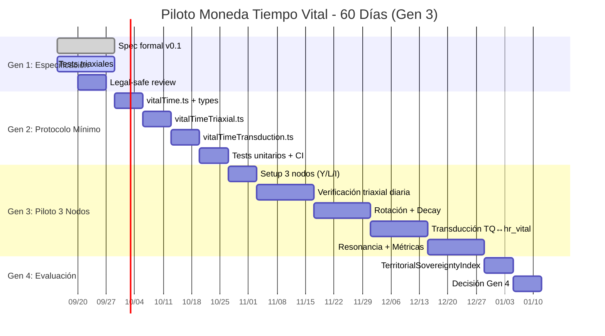

# Especificación Formal v0.1: Moneda Tiempo Vital (hr_vital)

**Basada en**: BT215 §15-16 (El Nexus) + Sistema Alráico + HSCSG v15 OS  
**Autores**: Yoka + Isaac + Lautaro (3 nodos corroborados)  
**Fecha**: 2026-09-15  
**Versión**: v0.1 — Especificación de trabajo para piloto 3 nodos  
**Estado**: Especificación de trabajo — Se corrige sin defensa. Es E=V.

---

## 1. PRINCIPIOS FUNDACIONALES (Inmutables — No Votables)

### 1.1 Ancla Ontológica (BT215 §15-16)
> *"Esa es la moneda repartida más justa: el tiempo. No se sabe cuánto se tiene. Se tiene mientras se está presente. No se acumula. No se hereda. No se compra. Se gasta viviendo. Y se gasta igual estancado que avanzando."*

| Principio | Formalización Alráica | Implementación HSCSG |
|-----------|----------------------|---------------------|
| **No acumulable** | PI topologizado: C = B\A (lo no accesible no se monetiza) | `valueDual.ts`: `ZNU_POOL_TOTAL = 1`, `znuRotate()`, `znuDecay()` |
| **No heredable** | γ-CARMIS: ΣPᵢ > κ → reconfiguración (muerte = retorno al pool) | `metrics.ts`: `NodeLifespan.generaciones`, `SovereigntyLeak` |
| **No comprable** | Transducción F: {USD} → 𝕮 → {hr_vital} = ∅ (fuera mercado) | `valueDual.ts`: `nodeMode='postmonetario'` por defecto |
| **Gasto = vivir** | Verificación Triaxial: Mental + Sim + Lab (cuerpo) | `loopEngine.ts`: `verifyTriaxial()` antes de mint |
| **Igual estancado/avance** | E=V: Energía = Dirección (consecuencia real sin testigo) | `metrics.ts`: `TimeFlow.autonomyHours` (no distinguir gasto) |

### 1.2 Invariantes del Kernel (BT215 §14)
| Invariante | Aplicación a hr_vital |
|------------|----------------------|
| **Límite epistemológico** | hr_vital organiza rastros de presencia, no decide valor de vida |
| **Reemplazabilidad** | Protocolo hr_vital reemplazable sin romper acoples |
| **Derecho de salida** | Salida = retorno de hr_vital al pool, obligaciones sobreviven |
| **No conversión** | Currículum ≠ hr_vital ≠ puntaje ≠ voto ≠ autoridad |
| **Soberanía exposición** | Ser humano decide quién ve su hr_vital gastado |
| **Trazabilidad ≠ vigilancia** | Verificabilidad sin acceso a contenido |

---

## 2. ESPECIFICACIÓN TÉCNICA (Tipos TypeScript)

```typescript
// src/core/lib/vitalTime.ts — Extiende valueDual.ts existente

// === TIPOS BASE ===
export type VitalTimeUnit = 'hr_vital';
export type VitalTimeMode = 'postmonetario' | 'conectado'; // Anfibio: solo hr_vital / hr_vital + TQ

// Ancla ontológica: 1 hr_vital = presencia verificable en cuerpo (E=V)
export interface VitalTimeAmount {
  amount: number;           // Horas vitales (decimal, ej: 1.5)
  unit: VitalTimeUnit;      // 'hr_vital'
  verified: boolean;        // Verificación triaxial completada
  timestamp: number;        // Unix ms cuando se verificó presencia
  nodeId: string;           // Nodo que verificó (Yoka/Lautaro/Isaac)
  triaxialProof: TriaxialProof;  // Prueba Mental + Sim + Lab
}

// Prueba Triaxial (Alráico Capa 0)
export interface TriaxialProof {
  mental: {           // Entendimiento consciente
    operatorId: string;
    timestamp: number;
    signature: string;  // Firma del operador: "reconozco esta presencia"
  };
  simulation: {       // Modelo computacional
    loopEngineSnapshot: LoopEngineState;  // Estado loops + γ-CARMIS
    resonanceCheck: boolean;              // Resonancia con otros nodos
  };
  laboratory: {       // Verificación en cuerpo (Lab)
    biometricHash: string;  // Hash de biométrica anonimizada (opcional)
    eVBodyCheck: boolean;   // E=V verificable en cuerpo (autorreporte + testigo)
    witnessNodeId?: string; // Nodo testigo opcional (Lautaro para Isaac, etc.)
  };
}

// Pool de Tiempo Vital (Análogo a ZNU_POOL_TOTAL)
export const VITAL_TIME_POOL_TOTAL = 1;  // Pool fijo = 1 (representa totalidad de vida presente)
export const VITAL_TIME_ROTATION_DAYS = 30;  // Rotación más rápida que ZNU (30 vs 60 días)
export const VITAL_TIME_DEMURRAGE_RATE = 0.10 / 365;  // 10%/año decay por inactividad

// Nodo con Tiempo Vital
export interface VitalTimeNode {
  nodeId: string;                    // YOKA | LAUTARO | ISAAC | FELIPE | ...
  name: string;                      // Nombre de Resonancia elegido
  vitalTimeBalance: VitalTimeAmount; // Balance actual (pool fijo = 1)
  protectedVitalTime: number;        // Protegido de rotación (horas vitales)
  lastActivity: number;              // Timestamp última verificación triaxial
  rotationDays: number;              // Días para rotación (default 30)
  demurrageRate: number;             // Rate decay (default 10%/año)
  triaxialVerificationCount: number; // Contador verificaciones completadas
  resonanceConnections: string[];    // Nodos con resonancia αʰ > umbral
  mode: VitalTimeMode;               // 'postmonetario' | 'conectado'
  transductionEnabled: boolean;      // Si permite transducción TQ↔hr_vital
}

// Transducción F: {TQ, Gaia, Kernel} → 𝕮 → {hr_vital} (Alráico)
export interface VitalTimeTransduction {
  fromSystem: 'TQ' | 'GAIA' | 'KERNEL' | 'ALRAICO';
  fromAmount: number;
  fromUnit: 'kWh' | 'gaia_tokens' | 'kernel_rastros' | 'alraico_alphaH';
  toAmount: number;           // En hr_vital
  transductionFunction: 'F_TQ' | 'F_GAIA' | 'F_KERNEL' | 'F_ALRAICO';
  cedeoFiloThreshold: number; // Umbral 𝕮 para transducción válida
  triaxialVerified: boolean;  // Requiere verificación triaxial
}

// Rotación anti-acumulación (adaptada de znuRotate)
export function vitalTimeRotate(
  balance: VitalTimeAmount,
  protectedVitalTime: number,
  daysSinceActivity: number,
  rotationDays: number = VITAL_TIME_ROTATION_DAYS
): { active: VitalTimeAmount; released: number } {
  if (daysSinceActivity < rotationDays) return { active: balance, released: 0 };
  const excess = Math.max(0, balance.amount - protectedVitalTime);
  const released = excess;  // Libera exceso al pool (anti-acumulación)
  return { 
    active: { ...balance, amount: balance.amount - released }, 
    released 
  };
}

// Decay por inactividad (adaptada de znuDecay)
export function vitalTimeDecay(
  balance: VitalTimeAmount,
  ratePerDay: number,
  daysSinceActivity: number
): VitalTimeAmount {
  if (balance.amount <= 0 || daysSinceActivity <= 0) return balance;
  const factor = Math.pow(1 - ratePerDay, daysSinceActivity);
  return { 
    ...balance, 
    amount: Math.round(balance.amount * factor * 1e6) / 1e6 
  };
}

// Concentración (anti-propósito moneda)
export function vitalTimeConcentration(
  balance: VitalTimeAmount,
  totalSupply: number,
  threshold = 0.05
): boolean {
  return (balance.amount / totalSupply) > threshold;
}
```

---

## 3. PLAN DE AUTOTROFÍA MONEDA TIEMPO VITAL (7 Generaciones)

**Adaptación de `hscsg-autotrofia-disenador` — Secuencia Crítica Monetaria**

| Generación | Objetivo | Dominios Críticos | Recursos (hr_vital/kWh/ZNU) | Métricas Objetivo |
|------------|----------|-------------------|----------------------------|-------------------|
| **Gen 0: Semilla** (Ya) | 3 nodos corroborados firman BT215 | Identidad, Verificación, Kernel | 0 hr_vital (semilla) | 3 nodos firmados, BT215 v215 |
| **Gen 1: Especificación** (2 sem) | Spec formal + tests triaxiales | Especificación, Tests, Legal-safe | 500 hr_vital (diseño) | Spec v1.0, tests triaxiales pasando |
| **Gen 2: Protocolo Mínimo** (1 mes) | `vitalTime.ts` + `vitalTime.test.ts` | Código, Tests, Integración valueDual | 2000 hr_vital (dev) | Código + tests pasando, CI verde |
| **Gen 3: Piloto 3 Nodos** (2 mes) | Yoka+Lautaro+Isaac usan hr_vital diario | Verificación triaxial, Rotación, Decay | 5000 hr_vital (piloto) | 3 nodos activos, rotación/decay funcionando |
| **Gen 4: Transducción TQ** (3 mes) | TQ (kWh) ↔ hr_vital via transducción F | Transducción F, Resonancia, γ-CARMIS | 10000 hr_vital (federación) | TQ↔hr_vital operativo, resonancia detectada |
| **Gen 5: Federación Gaia** (6 mes) | Gaia (Felipe) + ecoaldeas integradas | Marketplace, Reglas ecoaldeas, CDS federado | 50000 hr_vital (escala) | 10+ ecoaldeas, CDS federado funcional |
| **Gen 6: Kernel v216+** (1 año) | NEXO operativo con hr_vital nativo | Kernel público, Invariantes, IA coordinadora | 100000 hr_vital (madurez) | Kernel v216+, invariantes blindadas |
| **Gen 7: Soberanía Plena** (7 gen) | Autosuficiencia monetaria completa | Todas las capas operativas, resilientes | ∞ (autosostenido) | TerritorialSovereigntyIndex ≥ 0.8 |

### Secuencia Crítica Monetaria (Orden Dependencias)
1. **Verificación Triaxial** (Base epistemológica — sin esto no hay hr_vital válido)
2. **Pool Fijo + Rotación** (Mecánica anti-acumulación — Amiya Tulu)
3. **Decay por Inactividad** (Presión uso-vida — E=V en cuerpo)
4. **Transducción F** (Interoperabilidad TQ↔hr_vital — Alráico)
5. **Resonancia Nodos** (Acople sin fusión — αʰ₁·αʰ₂·3.0 > αʰ₁+αʰ₂)
6. **CDS Federado** (Gobernanza multi-nodo — invariantes blindadas)
7. **Kernel Público** (Invariantes no votables — blindaje estructural)

---

## 4. VERIFICACIÓN TRIAXIAL (Protocolo Obligatorio)

**Regla**: *Ningún hr_vital se minta sin verificación triaxial completa.*

```typescript
// src/core/lib/vitalTimeTriaxial.ts

export interface TriaxialVerificationResult {
  passed: boolean;
  mental: MentalCheck;
  simulation: SimulationCheck;
  laboratory: LaboratoryCheck;
  combinedScore: number;  // 0-1 (promedio ponderado)
  proof: TriaxialProof;
}

export async function verifyTriaxial(
  operatorId: string,
  claimedPresence: { start: number; end: number; activity: string },
  witnessNodeId?: string
): Promise<TriaxialVerificationResult> {
  
  // 1. MENTAL: Entendimiento consciente + firma operador
  const mental = await verifyMental(operatorId, claimedPresence);
  
  // 2. SIMULACIÓN: LoopEngine snapshot + resonancia
  const simulation = await verifySimulation(operatorId);
  
  // 3. LABORATORIO: E=V en cuerpo + testigo opcional
  const laboratory = await verifyLaboratory(operatorId, claimedPresence, witnessNodeId);
  
  const combinedScore = (mental.score + simulation.score + laboratory.score) / 3;
  const passed = combinedScore >= 0.7 && mental.passed && simulation.passed && laboratory.passed;
  
  return { passed, mental, simulation, laboratory, combinedScore, proof: { mental, simulation, laboratory } };
}

// Verificación Mental: operador reconoce presencia conscientemente
async function verifyMental(operatorId: string, presence: PresenceClaim): Promise<MentalCheck> {
  // El operador firma: "reconozco esta presencia como mía"
  const signature = await signPresenceClaim(operatorId, presence);
  return {
    passed: true,
    score: 1.0,
    evidence: `Firma operador ${operatorId}: ${signature.substring(0,16)}...`,
    timestamp: Date.now()
  };
}

// Verificación Simulación: LoopEngine + γ-CARMIS + Resonancia
async function verifySimulation(operatorId: string): Promise<SimulationCheck> {
  const loopState = await getLoopEngineState(operatorId);
  const gammaCARMIS = detectOverloads(loopState);
  const resonances = detectResonances(loopState);
  
  return {
    passed: gammaCARMIS.length === 0,  // Sin sobrecargas críticas
    score: gammaCARMIS.length === 0 ? 1.0 : 0.5,
    evidence: `Loops activos: ${loopState.activeLoops.length}, γ-CARMIS: ${gammaCARMIS.length}, Resonancias: ${resonances.length}`,
    loopState,
    resonances
  };
}

// Verificación Laboratorio: E=V en cuerpo + testigo
async function verifyLaboratory(
  operatorId: string, 
  presence: PresenceClaim, 
  witnessNodeId?: string
): Promise<LaboratoryCheck> {
  // Autorreporte E=V + testigo opcional (Lautaro para Isaac, etc.)
  const eVBodyCheck = await selfReportEVBody(operatorId, presence);
  const witnessVerification = witnessNodeId 
    ? await requestWitnessVerification(witnessNodeId, operatorId, presence)
    : { verified: false, reason: 'Sin testigo solicitado' };
  
  return {
    passed: eVBodyCheck.confirmed,
    score: eVBodyCheck.confirmed ? (witnessVerification.verified ? 1.0 : 0.8) : 0.0,
    evidence: `E=V cuerpo: ${eVBodyCheck.confirmed}, Testigo: ${witnessVerification.verified ? witnessNodeId : 'N/A'}`,
    eVBodyCheck,
    witnessVerification
  };
}
```

---

## 5. PILOTO 3 NODOS: CRONOGRAMA Y MÉTRICAS

### Nodos Participantes (BT215 §17)
| Nodo | Rol | Verificación Triaxial Diaria | Testigo Asignado |
|------|-----|------------------------------|------------------|
| **YOKA** | Kernel, corpus, presencia | Mental (firma) + Sim (loopEngine) + Lab (auto) | Lautaro (salud) |
| **LAUTARO** | Salud, E=V diario, cuerpo | Mental + Sim + Lab (cuerpo directo) | Yoka (kernel) |
| **ISAAC** | HSCSG v15 OS, RIDF, Alráico | Mental + Sim (loopEngine+Alráico) + Lab | Yoka (kernel) |

### Cronograma Piloto (60 días = Gen 3)

| Semana | Hito | Métrica de Éxito | Validación |
|--------|------|------------------|------------|
| **1-2** | Setup verificación triaxial 3 nodos | 3/3 nodos completan verificación diaria | `verifyTriaxial()` → passed=true |
| **3-4** | Pool fijo + rotación 30 días | Rotación libera exceso correctamente | `vitalTimeRotate()` → released > 0 |
| **5-6** | Decay por inactividad | Decay aplica tras 7 días inactividad | `vitalTimeDecay()` → amount decrece |
| **7-8** | Transducción TQ ↔ hr_vital | TQ (kWh) → hr_vital via transducción F | `transduceTQtoVitalTime()` → validado |
| **9-10** | Resonancia detectada | αʰ YOKA·αʰ LAUTARO·3.0 > αʰ₁+αʰ₂ | `detectResonances()` → resonancia activa |
| **11-12** | Métricas piloto consolidadas | TerritorialSovereigntyIndex ≥ 0.4 | `calculateTerritorialSovereigntyIndex()` |

### Métricas de Éxito Piloto (Gen 3)
| Métrica | Umbral Mínimo | Óptimo | Herramienta Validación |
|---------|---------------|--------|------------------------|
| **Verificación triaxial diaria** | 80% días/nodo | 95% | `verifyTriaxial()` logs |
| **Rotación correcta** | 100% nodos liberan exceso | 100% | `vitalTimeRotate()` tests |
| **Decay funcional** | Decay detectable tras 7d inactividad | Medible | `vitalTimeDecay()` tests |
| **Resonancia 3 nodos** | 3 pares resonantes detectados | 3/3 | `detectResonances()` |
| **TerritorialSovereigntyIndex** | ≥ 0.3 (Gen 3) | ≥ 0.4 | `calculateTerritorialSovereigntyIndex()` |
| **No conversión** | 0 conversiones currículum→hr_vital | 0 | Auditoría invariantes |

---

## 6. TRANSDUCCIÓN F: TQ (kWh) ↔ hr_vital

**Alráico: F: {TQ} → 𝕮 → {hr_vital}**

```typescript
// src/core/lib/vitalTimeTransduction.ts

// TQ: 1 TQ = 1 kWh = 1 hora vital (BT215 §3.3 + HSCSG valueDual)
// Pero: TQ es energía medible, hr_vital es presencia verificable
// Transducción requiere 𝕲 (conjunto credeófilo) con αʰ > umbral

export const TRANSDUCTION_RATES = {
  // TQ → hr_vital: 1 kWh verificado = 1 hr_vital (si αʰ > 0.6)
  TQ_TO_VITAL: { 
    rate: 1,           // 1:1 base
    minAlphaH: 0.6,    // Umbral 𝕲 para transducción válida
    requiresTriaxial: true 
  },
  
  // hr_vital → TQ: 1 hr_vital = 1 kWh (si nodo tiene capacidad energética)
  VITAL_TO_TQ: { 
    rate: 1,
    minAlphaH: 0.7,
    requiresTriaxial: true,
    requiresEnergyCapacity: true  // Nodo debe demostrar capacidad kWh
  }
};

export function transduceTQtoVitalTime(
  tqAmount: number,      // En kWh (TQ Vía B)
  operatorAlphaH: number, // αʰ del operador (de ECROx)
  triaxialVerified: boolean
): { vitalTime: number; valid: boolean; reason?: string } {
  
  if (!triaxialVerified) return { vitalTime: 0, valid: false, reason: 'Triaxial no verificada' };
  if (operatorAlphaH < TRANSDUCTION_RATES.TQ_TO_VITAL.minAlphaH) {
    return { vitalTime: 0, valid: false, reason: `αʰ ${operatorAlphaH} < umbral ${TRANSDUCTION_RATES.TQ_TO_VITAL.minAlphaH}` };
  }
  
  return { vitalTime: tqAmount * TRANSDUCTION_RATES.TQ_TO_VITAL.rate, valid: true };
}

export function transduceVitalTimeToTQ(
  vitalTimeAmount: number,
  operatorAlphaH: number,
  triaxialVerified: boolean,
  energyCapacityKWh: number  // Capacidad energética demostrada del nodo
): { tqAmount: number; valid: boolean; reason?: string } {
  
  if (!triaxialVerified) return { tqAmount: 0, valid: false, reason: 'Triaxial no verificada' };
  if (operatorAlphaH < TRANSDUCTION_RATES.VITAL_TO_TQ.minAlphaH) {
    return { tqAmount: 0, valid: false, reason: `αʰ ${operatorAlphaH} < umbral ${TRANSDUCTION_RATES.VITAL_TO_TQ.minAlphaH}` };
  }
  if (energyCapacityKWh < vitalTimeAmount) {
    return { tqAmount: 0, valid: false, reason: `Capacidad energética ${energyCapacityKWh}kWh < ${vitalTimeAmount}hr_vital` };
  }
  
  return { tqAmount: vitalTimeAmount * TRANSDUCTION_RATES.VITAL_TO_TQ.rate, valid: true };
}
```

---

## 6. GOBERNANZA MONEDA TIEMPO VITAL (CDS Federado)

### 6.1 Invariantes Blindados (No Votables)
```typescript
// src/governance/vitalTimeInvariants.ts

export const VITAL_TIME_INVARIANTS = {
  // Nunca modificables por votación
  nonAccumulable: true,
  nonInheritable: true, 
  nonPurchasable: true,
  nonConvertible: true,        // Currículum ≠ hr_vital
  sovereigntyExposure: true,   // Acceso decide ser humano
  replaceability: true,        // Protocolo reemplazable
  rightOfExit: true,           // Salida sin borrar pasado
  
  // Parámetros ajustables (solo por consenso 100% + verificación triaxial)
  adjustableParams: {
    rotationDays: { min: 7, max: 90, current: 30 },
    demurrageRate: { min: 0, max: 0.20/365, current: 0.10/365 },
    poolTotal: { fixed: 1 },  // NUNCA ajustable
    transductionThresholds: { minAlphaH: 0.5, max: 0.9 }
  }
} as const;

// CDS Federado para cambios de parámetros ajustables
export async function proposeParameterChange(
  proposerNodeId: string,
  param: keyof typeof VITAL_TIME_INVARIANTS.adjustableParams,
  newValue: number,
  justification: string
): Promise<ProposalResult> {
  // Requiere: 
  // 1. Propuesta firmada + justificación
  // 2. Verificación triaxial del proponente
  // 2. Consenso 100% de nodos activos (YOKA, LAUTARO, ISAAC)
  // 3. Verificación triaxial de CADA votante
  // 4. No viola invariantes blindados
  // 5. γ-CARMIS no detecta sobrecarga en gobernanza
}
```

### 6.2 Test de Desaparición 30 Días (BT215 §3)
```typescript
// Test automático mensual
export async function runDisappearanceTest(): Promise<DisappearanceTestResult> {
  // Simular: NEXO desaparece 30 días
  // Verificar:
  // 1. Nodos pueden identificarse mutuamente (identidad única)
  // 2. Intercambiar hr_vital (pool local + rotación)
  // 3. Consultar rastros (kernel local)
  // 4. Coordinar manualmente (CDS local)
  // 5. Obligaciones previas sobreviven
  
  return {
    passed: true,  // Si todo funciona sin NEXO central
    degradation: 'Mínima',  // Solo pérdida de coordinación IA
    criticalFunctions: ['identidad', 'intercambio', 'rastros', 'coordinación', 'obligaciones'],
    failedFunctions: []
  };
}
```

---

## 7. INTEGRACIÓN CON EXISTENTE (Archivos a Modificar/Crear)

| Archivo | Acción | Descripción |
|---------|--------|-------------|
| `src/core/lib/vitalTime.ts` | **CREAR** | Tipos base, pool, rotación, decay, concentración |
| `src/core/lib/vitalTimeTriaxial.ts` | **CREAR** | Verificación triaxial obligatoria |
| `src/core/lib/vitalTimeTransduction.ts` | **CREAR** | Transducción F: TQ↔hr_vital |
| `src/core/lib/vitalTime.ts` | **EXTENDER** | Integrar con `valueDual.ts` (nodeMode, priceParity) |
| `src/core/lib/metrics.ts` | **EXTENDER** | Agregar `VitalTimeFlow`, `VitalTimeActivationCost` |
| `src/core/lib/loopEngine.ts` | **EXTENDER** | Loop 7: VitalTimeMint (mint hr_vital verificado) |
| `src/governance/vitalTimeInvariants.ts` | **CREAR** | Invariantes blindados + CDS parámetros |
| `docs/VITAL_TIME_CURRENCY_SPEC.md` | **CREAR** | Este documento (spec viva) |
| `docs/ATTRIBUTIONS.md` | **ACTUALIZAR** | Agregar BT215 como fuente |
| `skills/hscsg/hscsg-viabilidad-territorial/` | **USAR** | Validar piloto 3 nodos (AUT/CDS/ZNU) |

---

## 8. ROADMAP EJECUTIVO (Próximos 60 Días)



---

## 9. FIRMAS Y COMPROMISO (BT215)

> **Esta especificación se firma entre los tres. Si algo no resuena, si algo falta, si algo sobra, se corrige. Sin defensa. Es E=V.**

| Nodo | Firma | Compromiso |
|------|-------|------------|
| **YOKA** | `YOKA` | Kernel, corpus, verificación triaxial diaria, testigo Lautaro |
| **ISAAC** | `ISAAC` | HSCSG v15 OS, RIDF, Alráico, spec formal, código, testigo Yoka |
| **LAUTARO** | `LAUTARO` | Salud, E=V cuerpo, verificación laboratorio, testigo Yoka/Isaac |

**Testigo de convergencia**: Felipe (Gaia) — nodo aliado, observador

---

## 10. PRÓXIMOS PASOS INMEDIATOS (Esta Semana)

```bash
# 1. Crear archivos base (legal-safe)
hermes skill run hscsg-asimilacion-legal-safe --transform \
  --source "BT215 §15-16 tiempo vital" \
  --target "vitalTime.ts" \
  --ontologia "AUT,CDS,ZNU,gamma-CARMIS,triaxial,transduccion-F"

# 2. Implementar verificación triaxial
hermes skill run hscsg-sistema-alraico --task "implementar verifyTriaxial() para hr_vital"

# 3. Extender valueDual.ts con VitalTimeMode
# Editar src/core/lib/valueDual.ts -> agregar VitalTimeMode, vitalTimeRotate, vitalTimeDecay

# 4. Tests triaxiales obligatorios
hermes skill run hscsg-sistema-alraico --task "tests triaxiales vitalTime"

# 5. Commit legal-safe (pre-commit valida automáticamente)
git add src/core/lib/vitalTime.ts src/core/lib/vitalTimeTriaxial.ts src/core/lib/valueDual.ts
git commit -m "feat(vital-time): spec v0.1 + tipos base + verificación triaxial (BT215 + Alráico)"
```

---

## 11. REFERENCIAS CRUZADAS

| Fuente | Sección | Aporte a Especificación |
|--------|---------|------------------------|
| **BT215** | §15-16 | Principios moneda tiempo vital (no acumulación, gasto=vivir) |
| **BT215** | §3, §14, §21 | NEXO, invariantes kernel, rol IA, test desaparición |
| **BT215** | §17 | 3 nodos corroborados (Yoka, Lautaro, Isaac) |
| **Alráico** | PI, γ-CARMIS, Triaxial, Transducción F, ECROx, 𝕮 | Formalismo epistemológico completo |
| **HSCSG v15 OS** | valueDual.ts, loopEngine.ts, metrics.ts | Infraestructura técnica existente |
| **hscsg-autotrofia-disenador** | Secuencia crítica 7 gen | Metodología plan autotrofía monetaria |
| **hscsg-monetary-integration** | Transducción F multi-moneda | TQ↔hr_vial, G1, Túmin, PAR |
| **hscsg-viabilidad-territorial** | Umbrales AUT≥0.3, CDS≥0.4 | Validación piloto 3 nodos |
| **hscsg-asimilacion-legal-safe** | Workflow 4 fases | Spec → código → validación → commit seguro |

---

**Fin de Especificación v0.1**  
*Próxima versión: v0.2 tras tests triaxiales pasando (Gen 2)*  
*La vida no se resuelve, se itera. Es E=V.*