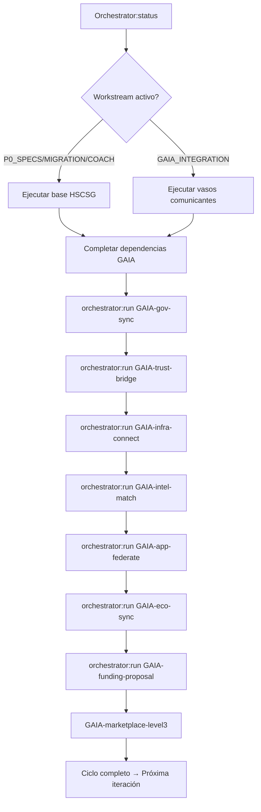

# HSCSG v15 OS ↔ Alianza Gaia-Mycelium Integration Skill

Integra operativamente la arquitectura HSCSG v15 OS (nodo soberano offline-first) con la Alianza Gaia-Mycelium (Meta Plataforma interoperable AI+Trust+Governance) usando principios IPD (Integrated Project Delivery) y arquitectura Trust-first.

## When to Use

- Tras completar brief exhaustivo HSCSG + análisis Gaia-Mycelium Alliance
- Usuario dice "integra Gaia-Mycelium", "colaboración HSCSG-Gaia", "arquitectura conjunta"
- Cada nueva sesión para avanzar en vasos comunicantes entre ambos ecosistemas
- Preparación de propuestas de financiación conjunta (sección 15 Gaia-Mycelium)

## Prerequisites

- HSCSG v15 OS deployado: `https://hscsg-v15-os.vercel.app` + `navteka` repo
- Gaia-Mycelium Alliance doc: `Downloads/Desktop/HSCSG dinero flores/nuevas integraciones/Gaia Mycelium Alliance.md`
- Skills disponibles: `hscsg-next-steps-orchestrator`, `hermes-agent-skill-authoring`
- Node 24.19 + pnpm 10.12.1, Vercel CLI, Git credential manager

## Arquitectura de Integración: Mapeo Capa a Capa

| Capa Gaia-Mycelium (Sección 17) | Componente HSCSG v15 OS | Vaso Comunicante | Estado |
|----------------------------------|-------------------------|------------------|--------|
| **Capa 1 — Gobernanza** (Gaia DAO, reglas, soberanía) | CDS-SUI-CGC-FRS-RAO + Autómata Soberano (Leyes MJ) | `governance:sync` — CDS ↔ Gaia DAO proposals, veto MJ Gate | 🟡 Parcial |
| **Capa 2 — Datos & Trust** (Data Trust, DIDs, VC, Trust Registries) | ValueFlows + RAO + ERC-8004 + ZNU/Vesting | `trust:bridge` — VC ↔ NetBenefitFlow, Trust Registry ↔ RAO | 🔴 Pendiente |
|| **Capa 3 — Infraestructura** (APIs, **Discovery Layer**, Project Weave) | neko-rooms + Boundaries (CEL) + Vasos neko:* | `infra:connect` — **Discovery Layer** ↔ neko, Project Weave ↔ Boundaries | 🟡 Parcial |
| **Capa 4 — Inteligencia** (Agentes IA, Recommendation, AI Matching) | Autómata + 10 Agentes Solarpunk + CoachFAB (Happpy) | `intel:match` — AI Matching ↔ Autómata E²R, Recommendation ↔ CoachFAB | 🟡 Parcial |
| **Capa 5 — Aplicaciones** (PHI, Map, Passport, Market, Gatherings, Fondos, Impact) | 21 módulos HSCSG + navteka (coach, boundaries, coworkers, briefs, vasos, neko) | `app:federate` — Marketplace ↔ CaaS-BM, PHI ↔ Life/Colectivo, Impact ↔ CAC/PGS | 🔴 Pendiente |
| **Capa 6 — Ecosistema Vivo** (Personas, comunidades, territorios, proyectos, orgs, conocimiento, recursos) | Base Material (13 Pilares) + Colectivo + Tekitl + Trustlines + FABSHIP | `eco:sync` — Territorios ↔ Base Material, Proyectos ↔ Tekitl, Conocimiento ↔ Conocimiento (AUT_CONO) | 🟡 Parcial |

---

## Vasos Comunicantes Operativos (Pipeline Governado)

| Vaso | Flujo HSCSG → Gaia | Flujo Gaia → HSCSG | Protocolo |
|------|-------------------|-------------------|-----------|
| `governance:sync` | CDS Decision Records → Gaia DAO proposals | Gaia DAO decisions → CDS Issues (MJ Gate eval) | Signed VC + RAO anchor |
| `trust:bridge` | NetBenefitFlow (BN→ZNU) → Gaia Trust Registry | Gaia VC (credenciales) → HSCSG ValueFlows events | DIDComm + Project Weave protocols |
|| `infra:connect` | neko-room sessions → **Discovery Layer** discovery | Project Weave connectivity → Boundaries policy allowlist | WebRTC + CEL policy |
| `intel:match` | Autómata E²R search results → Gaia AI Matching | Gaia Recommendation Engine → Autómata retrofeed | JSON-LD + verifiable inference |
| `app:federate` | CaaS-BM offers/needs → Gaia Marketplace | Gaia Market transactions → HSCSG ValueFlows + ZNU | Custom commission + Commonomics |
| `eco:sync` | Base Material metrics (CAC/PGS) → Gaia Impact Measurement | Gaia Score → HSCSG AUT vectors update | Multidimensional pipelines |

---

## Principios de Colaboración IPD (Integrated Project Delivery)

Aplicados desde la instrucción del usuario:

| Principio IPD | Implementación HSCSG-Gaia |
|---------------|---------------------------|
| **Front End Loading** | Fase 0 Proto-CO (HSCSG) + 90-day launch (Mycelium) = planning conjunto antes de build |
| **Multidisciplinar temprano** | Autómata (IA) + **Discovery Layer** (infra) + Project Weave (protocolos) + CDS (gobernanza) en mismo diseño |
| **Concurrent Engineering** | Migración DeseOS P1→P11 (HSCSG) || Gaia Marketplace + PHI + Map (paralelo, shared specs) |
| **TQM aplicado a ingeniería** | CAC/PGS/IVC métricas continuas + Gaia Score + Impact Measurement = single source of truth |
| **Integration Manager** | `hscsg-next-steps-orchestrator` skill = orchestrator técnico; Gaia Felipe = integration manager humano |

---

## Task Registry para Integración (Extiende orchestrator-state.json)

```json
{
  "GAIA_INTEGRATION": [
    {"id": "GAIA-gov-sync", "title": "Implementar governance:sync CDS↔Gaia DAO", "deps": ["P0-copiosis", "COACH-automaton"], "effort": 5, "value": 95, "workstream": "GAIA_INTEGRATION", "source": "agent", "priority": 95, "blocks": ["GAIA-trust-bridge", "GAIA-app-federate"], "status": "pending", "notes": "VC-signed Decision Records, MJ Gate veto, RAO anchor"},
    {"id": "GAIA-trust-bridge", "title": "Implementar trust:bridge NetBenefitFlow↔VC", "deps": ["GAIA-gov-sync", "P0-valueflows"], "effort": 5, "value": 93, "workstream": "GAIA_INTEGRATION", "source": "agent", "priority": 93, "blocks": ["GAIA-app-federate"], "status": "pending", "notes": "DIDComm, Project Weave, Trust Registry ↔ RAO"},
    {"id": "GAIA-infra-connect", "title": "Implementar infra:connect neko↔**Discovery Layer**", "deps": ["MIG-P10-Publica", "DEPLOY-link"], "effort": 4, "value": 90, "workstream": "GAIA_INTEGRATION", "source": "agent", "priority": 90, "blocks": ["GAIA-intel-match"], "status": "pending", "notes": "WebRTC discovery, Boundaries CEL allowlist"},
    {"id": "GAIA-intel-match", "title": "Implementar intel:match Autómata↔AI Matching", "deps": ["GAIA-infra-connect", "COACH-integration"], "effort": 4, "value": 92, "workstream": "GAIA_INTEGRATION", "source": "agent", "priority": 92, "blocks": ["GAIA-eco-sync"], "status": "pending", "notes": "E²R ↔ Recommendation Engine, verifiable inference"},
    {"id": "GAIA-app-federate", "title": "Implementar app:federate Marketplace↔CaaS-BM", "deps": ["GAIA-trust-bridge", "MIG-P5-Produce"], "effort": 5, "value": 94, "workstream": "GAIA_INTEGRATION", "source": "agent", "priority": 94, "blocks": ["GAIA-eco-sync"], "status": "pending", "notes": "Custom commission, Commonomics, ZNU settlement"},
    {"id": "GAIA-eco-sync", "title": "Implementar eco:sync Base Material↔Gaia Impact", "deps": ["GAIA-app-federate", "GAIA-intel-match"], "effort": 3, "value": 88, "workstream": "GAIA_INTEGRATION", "source": "agent", "priority": 88, "blocks": [], "status": "pending", "notes": "CAC/PGS ↔ Gaia Score, multidimensional pipelines"},
    {"id": "GAIA-funding-proposal", "title": "Propuesta financiación conjunta (Sección 15)", "deps": ["GAIA-gov-sync", "GAIA-trust-bridge"], "effort": 2, "value": 90, "workstream": "GAIA_INTEGRATION", "source": "agent", "priority": 90, "blocks": [], "status": "pending", "notes": "Arquitectura común: datos+confianza+IA+educación+proyectos+territorios+economía+regeneración"},
    {"id": "GAIA-marketplace-level3", "title": "Integrar Gaia AI Agent (Level 3) con CoachFAB", "deps": ["COACH-integration", "GAIA-infra-connect"], "effort": 3, "value": 85, "workstream": "GAIA_INTEGRATION", "source": "agent", "priority": 85, "blocks": [], "status": "pending", "notes": "Business+Personal assistance, Gaia ecosystem matchmaking"}
  ]
}
```

---

## Orquestadora de Colaboración (Meta-Skill)

Esta skill **es la orquestadora** que usa `hscsg-next-steps-orchestrator` como motor de ejecución.

### Flujo de Trabajo Colaborativo



### Comandos de Orquestación

```bash
# Ver estado integrado (HSCSG + GAIA)
node scripts/orchestrator-next-steps.js status --workstream=GAIA_INTEGRATION

# Ejecutar vaso específico
node scripts/orchestrator-next-steps.js run GAIA-gov-sync

# Ver grafo completo con critical path Gaia
node scripts/orchestrator-next-steps.js graph --include=GAIA_INTEGRATION

# Añadir tarea de usuario para integración
node scripts/orchestrator-next-steps.js add-task --workstream=GAIA_INTEGRATION

# Próxima óptima considerando dependencias cruzadas
node scripts/orchestrator-next-steps.js next --cross-workstream
```

---

## Critical Path Integrado (HSCSG + Gaia)

```
P0-netbenefit → P0-copiosis → COACH-automaton → COACH-integration 
    → MIG-P1-BranDNA → MIG-P5-Produce (auto-llenado)
    → GAIA-gov-sync → GAIA-trust-bridge → GAIA-app-federate
    → GAIA-eco-sync → GAIA-funding-proposal
    (28 días mínimos base + 15 días integración = 43 días)
```

**Dependencias críticas cruzadas:**
- `GAIA-gov-sync` requiere `P0-copiosis` (NetBenefitFlow types) + `COACH-automaton` (MJ Gate)
- `GAIA-trust-bridge` requiere `GAIA-gov-sync` (gobernanza) + `P0-valueflows` (types extendidos)
- `GAIA-app-federate` requiere `GAIA-trust-bridge` (VC settlement) + `MIG-P5-Produce` (ofertas CaaS-BM)
- `GAIA-intel-match` requiere `GAIA-infra-connect` (neko/**Discovery Layer**) + `COACH-integration` (BranDNA context)

---

## Protocolo de Confianza AI-First + Trust-First (Sección 11)

| Dimensión | HSCSG v15 OS | Gaia-Mycelium | Integración |
|-----------|--------------|---------------|-------------|
| **Datos** | ValueFlows events + RAO + CAC sensors | Data Trust + Ecosystem Mapping | Shared VC-anchored events |
| **Evidencia** | RAO append-only + Lucidez raw blocks | Verifiable Credentials + Trust Registries | RAO ↔ Trust Registry bridge |
| **Protocolo** | Boundaries CEL + MJ Gate + CDS | Project Weave + DIDComm | CEL ↔ Weave policy translation |
| **Inferencia** | Autómata E²R + NetBenefit Engine | AI Matching + Recommendation Engine | Verifiable inference pipeline |
| **IA** | CoachFAB (Happpy) + 10 Agentes Solarpunk | Gaia AI Agent (Level 3) | Unified agent interface |

**Regla de Oro (Sección 9):** *"La IA no debería inventar su propia evidencia"*
- Implementación: Todo output IA debe llevar `provenance: {dataSource, evidenceRef, protocol, inferenceChain}`
- CoachFAB + Gaia AI Agent comparten `LucidezVerifier` service

---

## Modelo Económico Integrado (Commonomics + CaaS-BM)

| Flujo | HSCSG | Gaia | Integrado |
|-------|-------|------|-----------|
| **Ingreso usuario** | Stake ZNU + CaaS-BM subscription | Level 1 Free / Level 2 $1-5 / Level 3 $5-10 | Unified tier: ZNU stake unlocks Gaia levels |
| **Comisión** | 10% affiliate / revenue share autómata | Custom 10-50% per offering + Commonomics | Commonomics formula applied to both |
| **Referidos** | ValueFlows peer-to-peer | 30% referral / 70% Gaia | Unified referral economy cross-platform |
| **Fondo común** | Fondo Solarpunk (25% excedentes autómata) | Gaia Technology Platforms Common Fund | Merged fund → Gaia Impact & Innovation Fund |
| **Superávit** | Subvenciones nodos PGS≥1.5 | Gaia Commons Surplus Formula → Impact Fund | Single surplus formula → regenerative investment |

---

## Próximos Pasos Inmediatos (Orquestador)

### Semana 1-2: Fundación (P0_SPECS + GAIA-gov-sync)
```bash
node scripts/orchestrator-next-steps.js run P0-netbenefit
node scripts/orchestrator-next-steps.js run P0-cds_jurados
node scripts/orchestrator-next-steps.js run P0-copiosis
node scripts/orchestrator-next-steps.js run P0-valueflows
node scripts/orchestrator-next-steps.js run GAIA-gov-sync
```

### Semana 3-4: Trust Bridge + Infra
```bash
node scripts/orchestrator-next-steps.js run GAIA-trust-bridge
node scripts/orchestrator-next-steps.js run MIG-P1-BranDNA
node scripts/orchestrator-next-steps.js run GAIA-infra-connect
```

### Semana 5-6: Intel + App Federation
```bash
node scripts/orchestrator-next-steps.js run COACH-automaton
node scripts/orchestrator-next-steps.js run COACH-integration
node scripts/orchestrator-next-steps.js run GAIA-intel-match
node scripts/orchestrator-next-steps.js run GAIA-app-federate
```

### Semana 7: Eco Sync + Funding
```bash
node scripts/orchestrator-next-steps.js run GAIA-eco-sync
node scripts/orchestrator-next-steps.js run GAIA-funding-proposal
node scripts/orchestrator-next-steps.js run GAIA-marketplace-level3
```

---

## Verification Checklist (Integrado)

- [ ] **GAIA-gov-sync**: CDS Decision Records → Gaia DAO proposals (VC signed), MJ Gate veto functional
- [ ] **GAIA-trust-bridge**: NetBenefitFlow ↔ VC settlement, Trust Registry ↔ RAO sync, DIDComm working
- [ ] **GAIA-infra-connect**: neko rooms discoverable via **Discovery Layer**, Boundaries CEL allows Project Weave protocols
- [ ] **GAIA-intel-match**: Autómata E²R ↔ Gaia Recommendation, verifiable inference chains, CoachFAB unified
- [ ] **GAIA-app-federate**: CaaS-BM offers in Gaia Market, custom commission + Commonomics, ZNU settlement
- [ ] **GAIA-eco-sync**: CAC/PGS ↔ Gaia Score bidirectional, multidimensional pipelines operational
- [ ] **GAIA-funding-proposal**: Joint proposal submitted, architecture docs unified
- [ ] **GAIA-marketplace-level3**: Gaia AI Agent + CoachFAB unified interface, business+personal assistance

---

## Riesgos y Mitigación (Sección 16 + HSCSG)

| Riesgo | Mitigación HSCSG | Mitigación Gaia | Conjunta |
|--------|------------------|-----------------|----------|
| Dependencia tecnológica | Offline-first, localStorage/IndexedDB | Protocolos abiertos, DIDComm | **Hybrid: local-first + interoperable protocols** |
| Captura institucional | Autómata soberano (Leyes MJ) + CDS distribuido | Gobernanza distribuida + Data Trust | **Dual governance: CDS + Gaia DAO, veto mutuo** |
| Concentración poder | Rotación agentes (PIP) + Talent Market | Autonomías interdependientes (holón) | **Rotation + holón architecture** |
| Dependencia financiera | Fondo Solarpunk + DSI + ZNU demurrage | Diversidad fuentes + Commonomics | **Unified fund + multiple revenue streams** |
| IA no auditable | Modo Lucidez + RAO + MJ Gate | Trust-first + verifiable pipelines | **LucidezVerifier service compartido** |

---

## Related Skills

- `hscsg-next-steps-orchestrator` — Motor de ejecución con task registry, priorización, continuity
- `hermes-agent-skill-authoring` — Estándares para documentar cada vaso comunicante como skill
- `plan` — Para crear plan detallado por workstream de integración